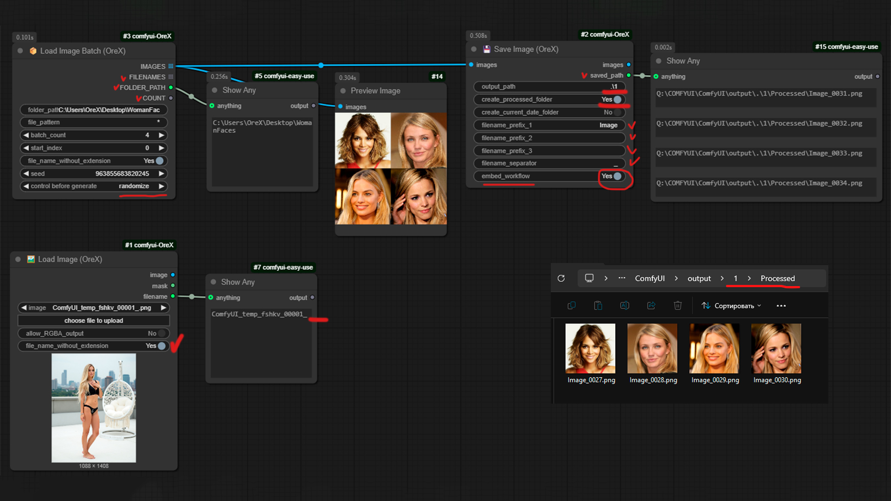

# 🤫 Comfyui : OreX nodes 

Это активно наполняемый набор узлов для разных задач. На данный момент в комплект набора входят узлы:
- Для работы с бесплатными онлайн LLM моделями (большой набор). Узлы Text to prompt - для расширения подсказки или общения с LLM моделью. Узлы Image URL to Prompt - для описания изображений поданых по ссылке. Узлы Image to Prompt - для описания входного изображения из Load Image.
- Узлы для одиночной и пакетной загрузки и сохранения изображений с расширинным функционалом.

💡 Набор узлов активно развивается 💡

# Купить кофе и отправить сообщение разработчикам: ☕  ☕  ☕
Дайте мне знать, если у вас возникнут какие-либо проблемы и мы постараемся их исправить!
Поддержать этот проект можно по ссылке: ❤️❤️❤️ <[Donat](https://www.donationalerts.com/r/orex21)> ❤️❤️❤️

# ⚒️ Ведущие проекта ⚒️

1 -  OreX (Олег К.)
2 -  Павел К.

# 📋 Меню узлов
`1.` [🖼️🔃 Load & Save single and batch images](#1----Load & Save single and batch imagest)

## 1 - 🖼️🔃 Load & Save single and batch images

**Узел Save Image поддерживает:**
- Добавление до 3х префиксов в названии.
- Удаление workflow из png.
- Добавление папки Processed для сохрания и исключения зацикливания при Batch (Вкл / Выкл).
- Аналогично папку с текущей датой (Вкл / Выкл).
- Можно задавать полный или относительный путь для сохранения изображений или оставить по умолчанию папку output.

**Узел Load Image поддерживает:**
- Вывод имени файла изображения, для дальнейшего именования в узде Save Image.
- Удаление расширения из имени файла.

**Узел Load Image Batch поддерживает:**
- Выбор файлов с определенной последовательностью в имени файла
- Выбор кол-ва, обрабатываемых файлов.
- Выбор изображений по именной маске (* для обработки всех файлов).
- Если в batch_count число больше, чем кол-во файлов, то повторная обработка файлов происходить не будет❗
- Файлы всегда обрабатываются от меньшего к большему, seed нужен только для возможности повторного запуска схемы, если выберите fixed то схема повторно запускаться не будет.

Update 0.1 : Добавлен узед Load Batch 

**Currently, the following models are available:**
- **deepseek-ai/DeepSeek-R1**: A versatile model for general language tasks.
- **Qwen/QwQ-32B**: Designed for high-performance language understanding and generation.
- **meta-llama/Llama-3.2-90B-Vision-Instruct**: Combines vision and language capabilities for multimodal tasks.
- **deepseek-ai/DeepSeek-R1-Distill-Llama-70B**: A distilled version of DeepSeek-R1 for efficient performance.
- **meta-llama/Llama-3.3-70B-Instruct**: An instruction-tuned model for various language tasks.
- **deepseek-ai/DeepSeek-R1-Distill-Qwen-32B**: Distilled for efficiency while maintaining high performance.
- **deepseek-ai/DeepSeek-R1-Distill-Llama-8B**: A smaller, efficient version of the DeepSeek-R1 model.
- **deepseek-ai/DeepSeek-R1-Distill-Qwen-14B**: Balances performance and efficiency for language tasks.
- **deepseek-ai/DeepSeek-R1-Distill-Qwen-7B**: A compact model suitable for various applications.
- **deepseek-ai/DeepSeek-R1-Distill-Qwen-1.5B**: Lightweight and efficient for quick language tasks.
- **microsoft/phi-4**: A robust model for general language understanding and generation.
- **mistralai/Mistral-Large-Instruct-2411**: Optimized for instruction-following tasks.
- **neuralmagic/Llama-3.1-Nemotron-70B-Instruct-HF-FP8-dynamic**: Efficient and dynamic for various language tasks.
- **google/gemma-2-9b-it**: A model designed for Italian language tasks.
- **nvidia/AceMath-7B-Instruct**: Specialized in mathematical problem-solving.
- **CohereForAI/aya-expanse-32b**: A large model for expansive language understanding.
- **Qwen/Qwen2.5-Coder-32B-Instruct**: Optimized for coding and instruction-following tasks.
- **THUDM/glm-4-9b-chat**: Designed for conversational AI applications.
- **CohereForAI/c4ai-command-r-plus-08-2024**: A command-focused model for precise instructions.
- **tiiuae/Falcon3-10B-Instruct**: Efficient and instruction-tuned for various tasks.
- **NovaSky-AI/Sky-T1-32B**: A large model for comprehensive language tasks.
- **bespokelabs/Bespoke-Stratos-32B**: Designed for high-performance language understanding.
- **netease-youdao/Confucius-o1-14B**: A model with a focus on Chinese language tasks.
- **Qwen/Qwen2.5-1.5B-Instruct**: Lightweight and efficient for instruction-following.
- **mistralai/Ministral-8B-Instruct-2410**: Compact and optimized for instruction tasks.
- **openbmb/MiniCPM3-4B**: A smaller model for efficient language processing.
- **jinaai/ReaderLM-v2**: Specialized in reading comprehension tasks.
- **ibm-granite/granite-3.1-8b-instruct**: Robust and instruction-tuned for various applications.
- **microsoft/Phi-3.5-mini-instruct**: A mini version optimized for instruction tasks.
- **ozone-ai/0x-lite**: Lightweight and efficient for quick language tasks.
- **mixedbread-ai/mxbai-embed-large-v1**: Designed for embedding and language understanding.

**The nodes can operate in the following modes:**
- **txt to image**: Generate images from textual descriptions.
- **image 2 image**: Modify existing images based on textual instructions.

You can get a free API here: https://ai.io.net/ai/api-keys

by StableDif & OreX
