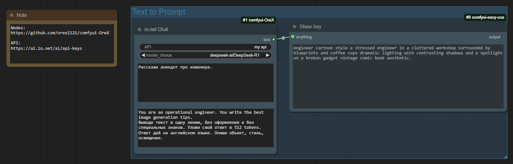
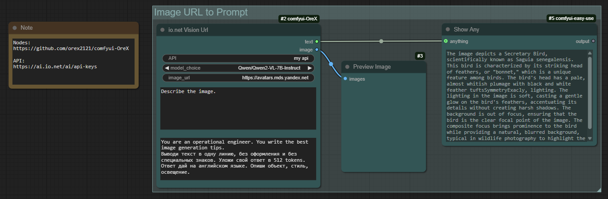
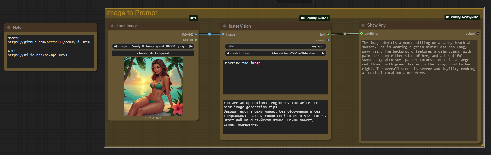

# 🤫 Comfyui - OreX nodes 

Это активно наполняемый набор узлов для разных задач. На данный момент в комплект набора входят узлы:
- Для работы с бесплатными онлайн LLM моделями (большой набор). Узлы Text to prompt - для расширения подсказки или общения с LLM моделью. Узлы Image URL to Prompt - для описания изображений поданых по ссылке. Узлы Image to Prompt - для описания входного изображения из Load Image.
- Узлы для одиночной и пакетной загрузки и сохранения изображений с расширинным функционалом.

💡 Набор узлов активно развивается 💡

## Купить кофе разработчикам: ☕  ☕  ☕
Дайте мне знать, если у вас возникнут какие-либо проблемы и мы постараемся их исправить!
Поддержать этот проект можно по ссылке: ❤️❤️❤️ **[D O N A T](https://www.donationalerts.com/r/orex21)** ❤️❤️❤️

## ⚒️ Ведущие проекта ⚒️
- OreX (Олег К.)
- Павел К.

## 📋 Меню узлов
`1.` [🖼️🔃 Load & Save single and batch images](#1----Load-&-Save-single-and-batch-images)  
`2.` [🖼️🔃 IO NET NODES](#2----IO-NET-NODES)

## 📝 Описание узлов

### 1. 🖼️🔃 Load & Save single and batch images

**Узел Save Image поддерживает:**
- Добавление до 3х префиксов в названии.
- Удаление workflow из png.
- Добавление папки Processed для сохрания и исключения зацикливания при Batch (Вкл / Выкл).
- Аналогично папку с текущей датой (Вкл / Выкл).
- Можно задавать полный или относительный путь для сохранения изображений или оставить по умолчанию папку output.

**Узел Load Image поддерживает:**
- Вывод имени файла изображения, для дальнейшего именования в узде Save Image.
- Удаление расширения из имени файла.

**Узел Load Image Batch поддерживает:**
- Выбор файлов с определенной последовательностью в имени файла
- Выбор кол-ва, обрабатываемых файлов.
- Выбор изображений по именной маске (* для обработки всех файлов).
- Если в batch_count число больше, чем кол-во файлов, то повторная обработка файлов происходить не будет❗
- Файлы всегда обрабатываются от меньшего к большему, seed нужен только для возможности повторного запуска схемы, если выберите fixed то схема повторно запускаться не будет.

### 2. 🖼️🔃 IO NET NODES

**Узел io.net Chat**
- Для общения или расширения подсказки с помощью LLM модели.
- Поддерживает системный Prompt.
- Большое кол-во поддерживаемых моделей.
- Бесплатное API можно получить тут: `https://ai.io.net/ai/api-keys`
- 

**Узел io.net Vision url**
- Для описания изображения поданого по ссылке или общение с LLM моделью относительно изображения поданого по ссылке.
- Бесплатное API можно получить тут: `https://ai.io.net/ai/api-keys`
- 

**Узел io.net Vision**
- Для описания входного изображения из Load Image или общение с LLM моделью относительно изображения.
- Бесплатное API можно получить тут: `https://ai.io.net/ai/api-keys`
- 

**Поддерживаемые модели в режиме чата:** deepseek-ai/DeepSeek-R1, Qwen/QwQ-32B, deepseek-ai/DeepSeek-R1-Distill-Llama-70B, meta-llama/Llama-3.3-70B-Instruct, deepseek-ai/DeepSeek-R1-Distill-Qwen-32B, neuralmagic/Llama-3.1-Nemotron-70B-Instruct-HF-FP8-dynamic, и много других моделей.
**Поддерживаемые модели в режиме анализа изображений:** meta-llama/Llama-3.2-90B-Vision-Instruct, Qwen/Qwen2-VL-7B-Instruct.

___
**by StableDif & OreX**
