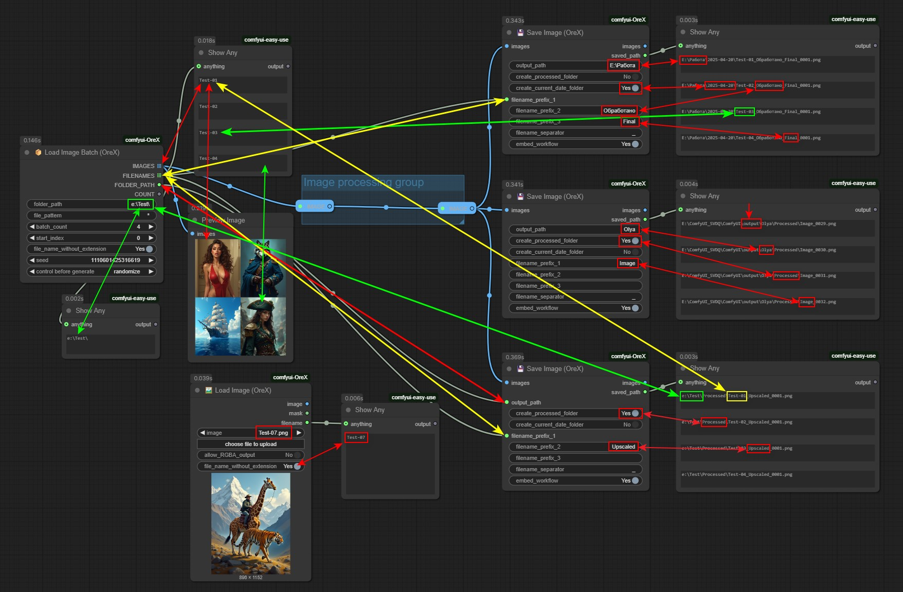

💡💡💡 УДАЛИТЕ УЗЛЫ ИЗ CUSTOME_NODES И УСТАНОВИТЕ ИХ ЗАНОВО.

# 🤫 Comfyui - OreX nodes 

Это активно наполняемый набор узлов для разных задач. На данный момент в комплект набора входят узлы:
- Для работы с LM-Studio моделями.
- Узлы для одиночной и пакетной загрузки и сохранения изображений с расширинным функционалом.

💡 Набор узлов активно развивается 💡

## Купить кофе разработчикам: ☕  ☕  ☕
Дайте мне знать, если у вас возникнут какие-либо проблемы и мы постараемся их исправить!
Поддержать этот проект можно по ссылке: ❤️❤️❤️ **[D O N A T](https://www.donationalerts.com/r/orex2121)** ❤️❤️❤️

## ⚒️ Ведущие проекта ⚒️
- OreX (Олег К.)
- Павел К.

## 📋 Меню узлов
`1.` [🖼️🔃 Load & Save single and batch images](#1----Load-&-Save-single-and-batch-images)  

## 📝 Описание узлов

### 1. 🖼️🔃 Load & Save single and batch images

**Узел Save Image поддерживает:**
- Добавление до 3х префиксов в названии.
- Удаление workflow из png.
- Добавление папки Processed для сохрания и исключения зацикливания при Batch (Вкл / Выкл).
- Аналогично папку с текущей датой (Вкл / Выкл).
- Можно задавать полный или относительный путь для сохранения изображений или оставить по умолчанию папку output.

**Узел Load Image поддерживает:**
- Вывод имени файла изображения, для дальнейшего именования в узде Save Image.
- Удаление расширения из имени файла.

**Узел Load Image Batch поддерживает:**
- Выбор файлов с определенной последовательностью в имени файла
- Выбор кол-ва, обрабатываемых файлов.
- Выбор изображений по именной маске (* для обработки всех файлов).
- Если в batch_count число больше, чем кол-во файлов, то повторная обработка файлов происходить не будет❗
- Файлы всегда обрабатываются от меньшего к большему, seed нужен только для возможности повторного запуска схемы, если выберите fixed то схема повторно запускаться не будет.

___
**by StableDif & OreX**
