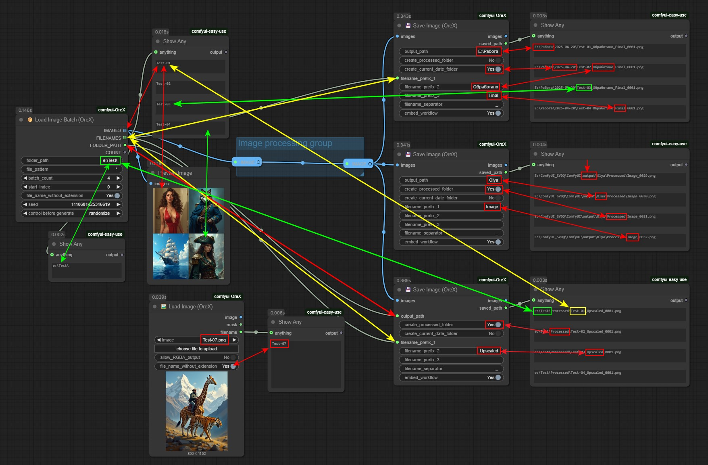

**[🇷🇺 Русский](#russian) | [🇬🇧 English](#english)**

---

## 🇷🇺 Русский

💡💡💡 УДАЛИТЕ УЗЛЫ ИЗ CUSTOME_NODES И УСТАНОВИТЕ ИХ ЗАНОВО.

# 🤫 Comfyui - OreX nodes 

Это активно наполняемый набор узлов для разных задач: работа с AI-моделями и сервисами (LM-Studio, Ollama, AI-ретушь и другая нейросетевая обработка), расширенная работа с изображениями, видео и аудио (загрузка, сохранение, кроп, разбиение и сборка изображений по частям, сравнение, объединение) и служебные узлы для управления workflow (строки, стили, пресеты, LoRA и т.д.).

💡 Набор узлов активно развивается 💡

### Купить кофе разработчикам: ☕  ☕  ☕
Дайте мне знать, если у вас возникнут какие-либо проблемы и мы постараемся их исправить!
Поддержать этот проект можно по ссылке: ❤️❤️❤️ **[D O N A T](https://www.donationalerts.com/r/orex2121)** ❤️❤️❤️

### ⚒️ Ведущие проекта ⚒️
- OreX (Олег К.)
- PaBoKor (Павел К.)

### 📋 Меню узлов
`1.` [🎬 Advanced Video Load — OreX (Олег К.)](#ru-1-advanced-video-load)  
`2.` [🔊 Audio Load — OreX (Олег К.)](#ru-2-audio-load)  
`3.` [📷 Camera Raw — PaBoKor (Павел К.)](#ru-3-camera-raw)  
`4.` [📝 Cip Text Encode — PaBoKor (Павел К.)](#ru-4-cip-text-encode)  
`5.` [✂️ Crop — OreX (Олег К.)](#ru-5-crop)  
`6.` [🧩 Image Chunk Cut — OreX (Олег К.)](#ru-6-image-chunk-cut)  
`7.` [🧩 Image Chunk Stich — OreX (Олег К.)](#ru-7-image-chunk-stich)  
`8.` [🔍 Image Compare — PaBoKor (Павел К.)](#ru-8-image-compare)  
`9.` [🖇️ Image Merging — OreX (Олег К.)](#ru-9-image-merging)  
`10.` [🖇️ Image Merging V2 — PaBoKor (Павел К.)](#ru-10-image-merging-v2)  
`11.` [🤖 LM Studio — OreX (Олег К.)](#ru-11-lm-studio)  
`12.` [🎛️ Lora Loader — PaBoKor (Павел К.)](#ru-12-lora-loader)  
`13.` [🦙 Ollama — OreX (Олег К.)](#ru-13-ollama)  
`14.` [📐 Ratio — OreX (Олег К.)](#ru-14-ratio)  
`15.` [📏 Scail — OreX (Олег К.)](#ru-15-scail)  
`16.` [✨ Skin Retouching AI — PaBoKor (Павел К.)](#ru-16-skin-retouching-ai)  
`17.` [🔤 String Function — OreX (Олег К.)](#ru-17-string-function)  
`18.` [🔤 String Selector — OreX (Олег К.)](#ru-18-string-selector)  
`19.` [🎨 Style Selector — OreX (Олег К.)](#ru-19-style-selector)  
`20.` [📝💾 Text Save — OreX (Олег К.)](#ru-20-text-save)  
`21.` [🎬 Video Preview — OreX (Олег К.)](#ru-21-video-preview)  
`22.` [🖼️🔃 Load Image — PaBoKor (Павел К.)](#ru-22-load-image)  
`23.` [🖼️🔃📦 Load Image Batch — PaBoKor (Павел К.)](#ru-23-load-image-batch)  
`24.` [🖼️📦📏 Load Image Batch Size — PaBoKor (Павел К.)](#ru-24-load-image-batch-size)  
`25.` [💾 Save Image — PaBoKor (Павел К.)](#ru-25-save-image)  
`26.` [🖌️ Kontext Presets — OreX (Олег К.)](#ru-26-kontext-presets)  
`+` [🧰 Экспорт/импорт workflow как изображения](#ru-extra-workflow-image)  

### 📝 Описание узлов

#### 1. 🎬 Advanced Video Load
Автор: OreX (Олег К.)

**Узел поддерживает:**
- Загрузку видео по прямому пути на диске (`video_path`) — как абсолютному, так и по имени файла в папке `input`.
- Загрузку больших файлов прямо в интерфейсе узла: зона drag & drop / выбора файла с делением на чанки по 10 МБ, отправляемые на серверный эндпоинт `/orex/upload_chunk` (тот же эндпоинт использует и узел Audio Load; регистрирует его модуль `OreX_AudioLoad.py`, так что для загрузки файлов оба узла зависят от его наличия в пакете); после загрузки путь автоматически подставляется в поле `video_path`.
- Три режима работы со звуком (`audio_mode`):
  - **Mute Original (Fast)** — мгновенное копирование видеопотока без перекодирования, звук полностью убирается.
  - **Replace (Fast)** — мгновенная замена звука: видео копируется потоком, аудио берётся из подключённого входа `new_audio` (если он не подключён — видео и звук просто копируются как есть, без изменений).
  - **Mix Audio (Re-encode audio)** — смешивание оригинальной дорожки и `new_audio` с раздельной регулировкой громкости через `amix`; если `new_audio` не подключён — просто перекодирует и регулирует громкость оригинальной дорожки.
- Регулировку громкости оригинальной (`orig_vol`) и новой (`new_vol`) дорожек, 0.0–2.0.
- Опциональный вход `new_audio` (AUDIO) для замены или подмешивания звука из другого узла (например, из Audio Load).
- Встроенный видеоплеер прямо на узле: показывает исходное видео по указанному пути и автоматически переключается на показ результата после выполнения workflow.
- Всю обработку через ffmpeg (используется бинарник из пакета `imageio_ffmpeg`, если он установлен, иначе — системный `ffmpeg` из PATH); результат сохраняется во временную папку ComfyUI с уникальным именем.

#### 2. 🔊 Audio Load
Автор: OreX (Олег К.)

**Узел поддерживает:**
- Загрузку аудио (или звуковой дорожки из видеофайла) по пути (`audio`) — вручную или через drag & drop/выбор файла прямо на узле.
- Тот же механизм чанковой загрузки больших файлов (по 5 МБ), что и Advanced Video Load, через общий эндпоинт `/orex/upload_chunk`, который этот узел и регистрирует на сервере.
- Обрезку звука с двух концов: `trim_start_sec` / `trim_end_sec` — слайдеры (в секундах), `trim_start` / `trim_end` — точные числовые поля; каждая пара синхронизирована в обе стороны (двигаешь слайдер — обновляется точное поле, и наоборот). Точное поле имеет приоритет, если задано ненулевое значение.
- Ползунок обрезки конца дорожки (`trim_end_sec`) отрисован и работает в обратную сторону (заполняется и перетаскивается справа налево) — так интуитивнее видно, сколько «отрезается» от конца.
- Автосброс всех четырёх параметров обрезки в 0 при смене файла.
- Встроенный аудиоплеер на узле: кнопка play/pause, шкала перемотки, индикатор времени; воспроизведение всегда идёт строго в границах текущей обрезки (начинается с `trim_start`, останавливается и сбрасывается на `trim_end`).
- Последовательную попытку загрузки через pydub → soundfile → torchaudio (пробует по очереди; при провале всех трёх — подробная ошибка со списком причин и рекомендацией проверить ffmpeg).
- Вывод: обрезанное аудио (`audio_out`), фактически использованный путь к файлу (`file_path`), длительность обрезанного фрагмента в секундах (`duration`).

#### 3. 📷 Camera Raw
Автор: PaBoKor (Павел К.)

Продвинутый узел цветокоррекции: не просто набор слайдеров, а полноэкранный визуальный редактор с живым предпросмотром, который пересчитывается на JS в точности по той же математике, что и финальный рендер на Python — то, что видно в редакторе, соответствует результату после Run.

**Узел поддерживает:**
- 17 слайдеров Camera Raw: Exposure, Contrast, Highlights, Shadows, Whites, Blacks, Temperature, Tint, Colorfulness, Saturation, Texture, Clarity, Dehaze, Grain, Sharpening, Gaussian Blur, Vignette — плюс общий переключатель `Enable Settings`, который отключает все настройки разом, не сбрасывая их значения (удобно для сравнения до/после).
- Панель **HSL**: Master-канал + 6 цветовых диапазонов (reds/yellows/greens/cyans/blues/magentas), у каждого — Hue/Saturation/Lightness; режим **Colorize** (перекрашивает изображение в один тон, сохраняя структуру светлот); инструмент-«пипетка» — клик по изображению сразу переключает на канал того цветового диапазона, к которому относится выбранный пиксель.
- Панель **RGB Curves**: 4 независимых канала (общий RGB + отдельно R/G/B), плавная кривая через произвольные контрольные точки (сплайн Catmull-Rom), применяется как LUT на 256 значений.
- Дополнительные детализирующие слайдеры: Texture (мелкие высокочастотные детали), Clarity (локальный контраст средних частот, с защитой светов и теней), Sharpening, Gaussian Blur, Grain (имитация плёночного зерна), Dehaze (в плюс — убирает дымку за счёт локального контраста/насыщенности в плоских участках, в минус — наоборот смягчает), Vignette.
- Undo/Redo, сброс отдельного канала HSL/Curves и общий сброс Camera Raw, переключатель HQ Preview, кнопку Recenter (по клику центрирует и подгоняет масштаб, с индикатором процента), режим сравнения до/после.
- Двуязычные (RU/EN) подсказки по каждому параметру — как во всплывающем тултипе на компактном виде узла, так и в самом полноэкранном редакторе.
- Настройки HSL и Curves хранятся как JSON в скрытых текстовых полях (`HSL Data`, `Curve Data`) вместе с флагами активности — состояние редактора сохраняется вместе с workflow.
- В превью узла (UI) всегда показывается оригинал без фильтров — чтобы JS-редактор всегда применял живые правки поверх исходника, а не поверх уже отфильтрованного результата.

#### 4. 📝 Cip Text Encode
Автор: PaBoKor (Павел К.)

Обёртка над стандартным узлом ComfyUI `CLIPTextEncode`, с поддержкой произвольного числа дополнительных текстовых входов, которые автоматически собираются в один промпт.

**Узел поддерживает:**
- Основной многострочный текст (`text`, с поддержкой dynamic prompts) и стандартный вход `clip`.
- Динамически появляющиеся дополнительные входы `string1`, `string2`, ... (STRING): новый вход добавляется автоматически, как только подключён последний из существующих, и убирается обратно, если отключить — вручную ничего заводить не нужно.
- Сборку финального промпта: значения всех подключённых и непустых `stringN`-входов подставляются перед основным текстом через запятую, в порядке номеров (удобно собирать промпт из кусков — например, из Style Selector или String Selector — не соединяя их вручную текстовыми конкатенациями).
- Вывод и готового `CONDITIONING`, и итоговой строки промпта (`PROMPT`) — можно посмотреть/использовать дальше, что реально ушло в CLIP.

#### 5. ✂️ Crop
Автор: OreX (Олег К.)

Интерактивный узел кадрирования с визуальным выделением области прямо на канвасе ноды — как в графическом редакторе, а не через ручной ввод координат.

**Узел поддерживает:**
- Область выделения прямо на превью изображения в узле: перетаскивание рамки целиком или за любую из 8 ручек (углы/стороны) мышью, с live-обновлением значений обрезки.
- Обрезку в процентах от каждого края (`crop_left/right/top/bottom`, 0–100%) — не привязана к конкретному разрешению, одни и те же настройки одинаково работают на разных по размеру изображениях.
- Три способа задать итоговый размер: явные `width`/`height` в пикселях; целевое разрешение в мегапикселях (`resolution (MP)`) — пересчитывается автоматически с сохранением текущих пропорций вырезанной области, если больше 0; и кратность (`multiplicity`, 1–64) — итоговые размеры округляются до ближайшего кратного (для совместимости с диффузионными моделями обычно 8/16/32/64).
- Блокировку пропорций (`ratio_lock`) — при изменении рамки или ширины/высоты сохраняется заданное соотношение сторон.
- Поле произвольных пропорций (`aspect_ratio`, текстом — например «5:7» или пиксели «300:1000») плюс быстрый выбор пресетов (1:1, 4:3, 3:4, 16:9, 9:16, 9:20, 2:3, 3:2, 21:9, Custom).
- Кнопки быстрых действий: **Full Image** (сбросить выделение на всё изображение), **Center** (переместить текущую область в центр), **Maximize** (растянуть до ближайших границ кадра с сохранением пропорций).
- 5 методов интерполяции при изменении размера: nearest-exact, bilinear, area, bicubic (по умолчанию), lanczos (через PIL, самый качественный).
- Опциональный вход `mask` — обрезается и масштабируется вместе с изображением (если не подключён, на выходе сплошная белая маска нужного размера).
- Защиту от искажений: если пропорции виджетов `width`/`height` разошлись с реальной обрезанной областью (например, остались от предыдущего изображения), итоговый размер пересчитывается от фактической рамки, а не от устаревших значений.
- Превью выделения генерируется самим узлом (с уменьшением до 1024px для скорости) и двуязычные (RU/EN) подсказки по каждому параметру.
- Вывод: обрезанное и масштабированное изображение, маска, итоговые ширина и высота.

#### 6. 🧩 Image Chunk Cut
Автор: OreX (Олег К.)

Разбивает последовательность изображений (например, кадры видео) на равные по длине куски — для обработки по частям в моделях с ограничением на число кадров за раз. Работает в паре с узлом Image Chunk Stich, который потом склеивает результат обратно.

**Узел поддерживает:**
- Длину чанка (`chunk_length`, по умолчанию 81 — типичный лимит кадров для видео-моделей).
- Автоматическое дополнение последовательности, если общее число кадров не делится на `chunk_length` без остатка: недостающие кадры добавляются в конец реверсом исходной секвенции (пинг-понг), а не дублированием последнего кадра или чёрными кадрами — это заметно меньше бросается в глаза на стыке.
- Настоящий list-вывод чанков (`image_chunks`) — ComfyUI автоматически прогоняет каждый чанк по цепочке узлов отдельно, без ручного разделения батча.
- Вывод количества добавленных «докладочных» кадров (`shortfall`) — это значение нужно передать в `trim_end` узла Image Chunk Stich, чтобы потом вырезать лишнее.
- Вывод исходной длины чанка (`chunk_length`) и итоговой длины последовательности после дополнения (`full_length`).

#### 7. 🧩 Image Chunk Stich
Автор: OreX (Олег К.)

Склеивает чанки, полученные от Image Chunk Cut (или любой другой list изображений), обратно в одну последовательность и обрезает лишние кадры.

**Узел поддерживает:**
- Приём списка чанков (`image_chunks`) как единого list-входа — ComfyUI подставляет сюда результат Image Chunk Cut без дополнительной сборки.
- Склейку всех чанков по порядку в одну последовательность.
- Обрезку по количеству кадров с начала (`trim_first`) и с конца (`trim_end`) — обычно `trim_end` берут из `shortfall`, который вернул Image Chunk Cut, чтобы убрать добавленные реверс-кадры; но можно использовать и для произвольной подрезки.
- Защиту от некорректной обрезки: если `trim_first` + `trim_end` съедают всю последовательность целиком (или больше), узел выводит предупреждение в консоль и возвращает 1 кадр вместо ошибки.
- Вывод: склеенная (и обрезанная) последовательность изображений и итоговое количество кадров (`frame_count`).

#### 8. 🔍 Image Compare
Автор: PaBoKor (Павел К.)

Интерактивный узел-вьювер для визуального сравнения двух изображений прямо на канвасе ComfyUI. Данные никуда дальше не передаёт — только показывает и умеет сохранить то, что видно.

**Узел поддерживает:**
- 5 режимов сравнения (`mode`): **Slider** (перетаскиваемая граница, открывающая второе изображение), **Side-by-Side**, **Overlap** (наложение с регулируемой прозрачностью), **Difference** (визуализация разницы пикселей), **Blink** (живое автоматическое перемигивание между изображениями с плавным кроссфейдом).
- Два опциональных входа изображения (`image_1`, `image_2`) — работает и с одним подключённым, просто как превью.
- Зум колесом мыши (1×–10×, к курсору) и панорамирование перетаскиванием — синхронно для обоих изображений.
- Регулировку прозрачности для режима Overlap (`opacity`) и скорости перемигивания для Blink (`blink_speed`).
- Кнопку **«Сохранить текущий вид»** — сохраняет именно то, что видно прямо сейчас: текущий режим, позицию слайдера, zoom и pan, в виде JPG-снимка; для режима Blink вместо снимка собирается зацикленный GIF с плавным кроссфейдом (фиксированный тайминг A→B→A, не зависящий от `blink_speed`).
- Опциональный вход `output_path` (строка): если подключён — сохраняет в `<путь>/<режим>/`; если нет — по умолчанию в `output/<сегодняшняя дата>/<режим>/`; у каждого режима свой отдельный счётчик файлов.
- Двуязычную подсказку с пояснением по управлению zoom/pan и точному поведению сохранения.

#### 9. 🖇️ Image Merging
Автор: OreX (Олег К.)

Собирает от 2 до 20 изображений в один коллаж по одному из нескольких шаблонов раскладки, с общими подписями и рамкой.

**Узел поддерживает:**
- Количество изображений (`image_number`, 2–20) — под каждое автоматически появляется свой вход `imageN` (пины добавляются/убираются в интерфейсе по мере изменения числа, без ручного пересоздания узла; высота узла всегда схлопывается до минимально нужной, без «лишнего воздуха»).
- 7 раскладок (`merging_mode`): horizontal, vertical, grid 2/3/4 (равномерная сетка), а также асимметричные grid 2+1 и grid 3+1, где одно изображение — крупное «главное», а остальные — мельче сбоку.
- Выбор «опорного» изображения (`main_resolution_image`), под пропорции которого выстраивается вся раскладка.
- Общий текстовый блок подписей (`text`, многострочный) — одна строка = подпись под соответствующим по порядку изображением.
- Настройку подложки под подписью: высоту (`footer_height`, % от высоты опорного изображения), размер шрифта (`font_size`, % от той же высоты), выбор шрифта из папки `fonts` пакета (с автоматическим фолбэком на системный шрифт по ОС, если файл не загрузился).
- 14 готовых цветовых пар фон/текст (`mode`) с уже подобранным контрастным цветом текста.
- Толщину рамки вокруг каждого изображения (`border_thickness`, % от высоты).
- 5 методов апскейла/ресайза при подгонке под раскладку: nearest-exact, bilinear, area, bicubic, lanczos (по умолчанию).
- Целевое разрешение результата в мегапикселях (`megapixels`) — если задано, вся раскладка пересчитывается заново под нужный итоговый размер с сохранением всех пропорций.
- Вывод: собранное изображение, его итоговые ширину и высоту.

#### 10. 🖇️ Image Merging V2
Автор: PaBoKor (Павел К.)

Тот же движок раскладки коллажа, что и в Image Merging, но с независимой подписью под каждым изображением вместо общего текстового блока.

**Отличия от Image Merging (v1):**
- Вместо одного общего многострочного поля `text` — отдельный вход `captionN` под каждое изображение (`caption1`, `caption2`, ...): можно вписать текст прямо в узле или подключить как STRING-вход из другого узла (например, String Selector) — независимо для каждого изображения.
- Поля подписи появляются и скрываются синхронно с полями изображений при изменении `image_number`, сохраняя своё содержимое, если временно спрятаны (не пересоздаются заново).
- Виджеты подписей всегда отсортированы и расположены сразу под соответствующими пинами изображений, для удобства.

**Остальная функциональность совпадает с Image Merging:** количество изображений (2–20), 7 раскладок (horizontal / vertical / grid 2,3,4 / grid 2+1 / grid 3+1), выбор опорного изображения, настройка подложки под подписью и шрифта, 14 цветовых пар, толщина рамки, 5 методов ресайза, целевое разрешение в мегапикселях, вывод изображения с шириной и высотой.

#### 11. 🤖 LM Studio
Автор: OreX (Олег К.)

Подключение к локальному серверу LM Studio (OpenAI-совместимый REST API) прямо из workflow — с поддержкой изображений, готовых системных пресетов и управлением VRAM.

**Узел поддерживает:**
- Выбор модели (`model_key`) — список подтягивается «вживую» с эндпоинта LM Studio `/v1/models` при создании узла; адрес сервера берётся из переменной окружения `LMSTUDIO_URL` (по умолчанию `http://127.0.0.1:1234`).
- Основной промпт (`text_input`, многострочный) + системный промпт (`system_prompt`), а также библиотеку готовых системных пресетов (`system_preset`), которые подгружаются из редактируемого JSON-файла рядом с узлом (создаётся автоматически с примерами при первом запуске); текст выбранного пресета добавляется после ручного системного промпта.
- Опциональный вход изображения — для vision-моделей; перед отправкой автоматически ужимается примерно до 0.7 мегапикселя.
- Переключатель «мышления» (`include_reasoning`): 🟢 — показывает цепочку рассуждений модели (теги `<think>`) в ответе; 🔴 — вырезает её (распознаёт несколько разных форматов тегов рассуждений, включая DeepSeek R1) и при этом снимает лимит токенов, чтобы модель гарантированно успела дописать сам ответ, а не только рассуждения.
- Управление VRAM: автовыгрузку модели после генерации (`auto_unload_model`, с задержкой `unload_delay` в секундах — сперва через SDK LM Studio, при неудаче — через REST; отложенная выгрузка автоматически отменяется, если для той же модели пришёл новый запрос, чтобы не ловить ошибки при батч-обработке) и/или выгрузку всех загруженных моделей ComfyUI перед обращением к LM Studio (`clean_vram_before`), чтобы освободить VRAM под LLM.
- Дополнительные параметры сэмплирования по отдельному переключателю (`generation_parameters`): длина контекста, максимум токенов (округляется до кратного 256; 0 = без лимита), temperature, top_k, top_p, repeat_penalty.
- `seed` для воспроизводимости.
- Вывод: сгенерированный текст и полный JSON-лог фактически отправленного запроса (модель, промпты, параметры) — удобно для отладки.
- Двуязычные подсказки по каждому параметру.

#### 12. 🎛️ Lora Loader
Автор: PaBoKor (Павел К.)

Полноценный менеджер стека LoRA прямо на канвасе узла (в духе Power Lora Loader из rgthree) — с автоматическим поиском триггер-слов и превью через Civitai.

**Узел поддерживает:**
- Динамический список LoRA: кнопка «➕ Add Lora» добавляет новую строку с выбором файла из выпадающего списка; строк можно добавить сколько угодно, применяются по порядку.
- Управление каждой строкой прямо кликом по канвасу, без отдельных виджетов: вкл/выкл конкретной LoRA, смена файла (клик по имени — выпадающее меню), сила эффекта с кнопками ◀/▶ (шаг 0.05) или точный ввод по клику на значение, переключатель учёта триггер-слов (💬/🔇), редактируемое поле триггер-слов (клик — ввод вручную), кнопка превью (👁️), перемещение строки вверх/вниз (▲/▼), удаление (🗑️).
- Общий переключатель в заголовке — одним кликом включает/выключает сразу все LoRA в списке.
- Автоматический поиск метаданных при выборе LoRA: узел последовательно проверяет локальный кэш `.orex.json`, `.civitai.info`, `.metadata.json`, `.rgthree-info.json`, `.json`-файл рядом, либо метаданные, встроенные в сам `.safetensors` — достаёт оттуда триггер-слова и превью-картинки; если локально ничего не нашлось, считает SHA-256 хэш файла и запрашивает Civitai API по хэшу, кэшируя результат в `.orex.json` на будущее.
- Галерею превью: клик по 👁️ открывает полноэкранный просмотр с навигацией «вперёд/назад» и панелью метаданных генерации; первая найденная картинка дополнительно скачивается и кэшируется локально (`.orex.preview.*`), чтобы дальше открывалась мгновенно — раздаётся через отдельный эндпоинт `/orex/view_preview`.
- Обнаружение пропавших файлов: если в сохранённом workflow указана LoRA, которой больше нет на диске, строка подсвечивается (⚠️), а `VALIDATE_INPUTS` останавливает выполнение понятной ошибкой «отсутствуют LoRA» вместо непонятного краша; отключённые строки в эту проверку не попадают.
- Вывод: изменённые MODEL и CLIP (LoRA применены по порядку стека), объединённая строка всех включённых триггер-слов (через запятую, только из строк с включённым учётом слов), объединённая строка имён использованных файлов LoRA (через « + »).

#### 13. 🦙 Ollama
Автор: OreX (Олег К.)

Близнец узла LM Studio, но подключается к локальному серверу Ollama. Использует тот же самый редактируемый файл системных пресетов (`OreX_Preset_LMStudio_Ollama.json`), что и LM Studio — пресеты, созданные для одного узла, доступны и в другом.

**Отличия от LM Studio (помимо другого сервера):**
- Подключается к нативному API Ollama (`/api/tags` — список моделей, `/api/chat` — генерация), а не к OpenAI-совместимому эндпоинту; адрес сервера — из переменной окружения `OLLAMA_URL` (по умолчанию `http://127.0.0.1:11434`).
- Выгрузка модели управляется через собственный параметр Ollama `keep_alive` прямо в запросе генерации (0 — выгрузить сразу после ответа, N секунд — держать в памяти столько-то) — без отдельного SDK/REST-запроса, как у LM Studio; если мгновенную выгрузку не удалось задать основным запросом, отправляется короткий дополнительный запрос, чтобы это гарантировать.
- Параметры сэмплирования сопоставляются с собственными именами опций Ollama (`num_predict`, `num_ctx` и т.д.).

**Всё остальное — как в LM Studio:** основной/системный промпт + пресеты, опциональное изображение (авто-ужатие до ~0.7 МП), переключатель показа цепочки рассуждений с той же regex-очисткой, очистка VRAM перед генерацией, дополнительные параметры сэмплирования, seed, вывод сгенерированного текста и полного JSON-лога запроса, двуязычные подсказки.

#### 14. 📐 Ratio
Автор: OreX (Олег К.)

Быстрый расчёт ширины/высоты под нужное соотношение сторон и целевое разрешение, сразу с готовыми пустыми латентами под разные архитектуры — расширенная замена стандартного узла ComfyUI «Empty Latent Image».

**Узел поддерживает:**
- 15 готовых пропорций кадра (квадрат, альбомная и портретная ориентация — от 1:1 до 32:9/9:32) плюс режим «Custom».
- Интерактивный превью-прямоугольник прямо на узле: показывает форму текущей пропорции в масштабе, а в режиме Custom позволяет перетаскивать любую из 8 ручек (углы/стороны) мышью, чтобы задать точную ширину/высоту на глаз — перетаскивание автоматически переключает `ratio` в Custom и синхронно обновляет поля ширины/высоты.
- Целевое разрешение в мегапикселях (`Megapixel`) с переключателем, что считать «одним мегапикселем»: 🟢 1024×1024 (≈1.05 МП, соответствует типичному разрешению обучения диффузионных моделей) или 🔴 1000×1000 (ровно 1.00 МП).
- Округление итоговых размеров до кратного выбранному числу (`Multiplicity`, 8–256, шаг 8) — под требования конкретных моделей (обычно 8/16/32/64).
- Три готовых пустых латента, рассчитанных сразу под итоговые размеры, под разные семейства моделей: стандартный SD1.5/SDXL (4 канала, уменьшение ×8), SD3/Flux 1 (16 каналов, ×8) и Flux 2 (128 каналов, ×16) — один узел закрывает сразу все варианты без дополнительных конверсионных узлов.
- Двуязычные подсказки.
- Вывод: ширина, высота и все три пустых латента (`empty_latent_image`, `empty_sd3_flux1_latent`, `empty_flux2_latent`).

#### 15. 📏 Scail
Автор: OreX (Олег К.)

Специализированный all-in-one сэмплер для генерации видео по позе через модель WAN SCAIL, с чанковой (оконной) обработкой для роликов длиннее, чем модель обрабатывает за один проход. Требует, чтобы в установке ComfyUI были доступны узлы WAN SCAIL (`comfy_extras.nodes_scail`) — это надстройка над ними, а не самостоятельный компонент.

**Узел поддерживает:**
- Автоматическую нарезку входного `pose_video` на перекрывающиеся чанки (`chunk_length`, `overlap`) и последовательный сэмплинг каждого — с передачей хвоста предыдущего чанка как контекста в следующий, что позволяет генерировать ролики значительно длиннее одного окна модели, сохраняя непрерывность движения на стыках.
- Автоматическую коррекцию числа кадров под формат, обязательный для WAN (4n+1) — как для длины чанка и перекрытия, так и для общего числа входных кадров (тихо округляет вниз до ближайшего допустимого значения, план разбиения выводится в консоль).
- Склейку соседних чанков с отбрасыванием повторяющихся (перекрывающихся) кадров и переносом цвета (`ColorTransfer`, метод `reinhard_lab`) с последнего кадра предыдущего чанка на первый кадр следующего — чтобы не было заметных скачков яркости/цвета на стыках.
- Стандартные входы условности SCAIL/WAN: `pose_video` (+ опциональная `pose_video_mask`), опциональные `reference_image`/`reference_image_mask`/`clip_vision_output` для сохранения идентичности/стиля, `pose_strength`/`pose_start`/`pose_end` — сила и временной диапазон влияния позы, переключатель `replacement_mode`.
- Стандартные параметры сэмплера: steps, cfg, sampler_name, scheduler, denoise; `noise_seed` автоматически увеличивается на 1 для каждого следующего чанка (для разнообразия при сохранении воспроизводимости).
- Оптимизацию памяти для длинных роликов: каждый готовый чанк сразу переносится в оперативную память, а кэш VRAM принудительно чистится между чанками — потребление видеопамяти не растёт с длиной ролика; прогресс отслеживается прогресс-баром, генерацию можно прервать.
- Вывод: собранное видео целиком (`images`), итоговое число кадров (`frames_numb`) и количество обработанных чанков (`iteration_numb`).

#### 16. ✨ Skin Retouching AI
Автор: PaBoKor (Павел К.)

AI-ретушь кожи через модель ModelScope (`damo/cv_unet_skin_retouching_torch`).

**Узел поддерживает:**
- Регулировку силы эффекта (`strength`) — смешивание оригинала с результатом сети.
- Компенсацию яркости результата (`density`), если модель делает картинку чуть светлее оригинала.
- Ограничение эффекта по маске (`mask`) с растушёвкой края (`mask_feather`).
- Веса модели скачиваются в общую папку `ComfyUI/models/modelscope/`, отдельно от кэша ModelScope и от самого пакета.

#### 17. 🔤 String Function
Автор: OreX (Олег К.)

Мини-движок шаблонов для сборки строки из до 4 произвольных входов, с поддержкой поиска-замены и подстановки переменных друг в друга.

**Узел поддерживает:**
- Многострочный шаблон (`string_function`) и 4 опциональных входа любого типа (`A`, `B`, `C`, `D`) — можно подключить что угодно, значение приводится к строке; неподключённая переменная просто удаляется из шаблона (её `{X}` превращается в пустую строку).
- Синтаксис плейсхолдеров `{A}`, `{B}`, `{C}`, `{D}` — подставляет значение соответствующего входа прямо в текст шаблона.
- Цепочку замен сразу после плейсхолдера: `{A}(old->new)` заменяет все вхождения «old» на «new» в значении A перед подстановкой; замены можно цеплять одну за другой, например `{A}(cat->dog)(dog->wolf)`.
- Обращение к другим переменным прямо внутри замены: `{A}(cat->{B})` — и то, что ищем, и то, на что заменяем, может содержать `{B}`/`{C}`/`{D}`, они подставляются первыми.
- Вспомогательный интерфейс на самом узле: 5 кнопок быстрой вставки ({A}/{B}/{C}/{D}/->), добавляющих нужный токен в позицию курсора в шаблоне, и значок «?» в заголовке узла, открывающий встроенную подсказку с напоминанием синтаксиса и двумя примерами.
- Вывод: итоговая собранная строка.

#### 18. 🔤 String Selector
Автор: OreX (Олег К.)

Выбирает одну строку из многострочного текста по номеру — простой способ хранить набор вариантов (промптов, тегов и т.п.) в одном узле и переключаться между ними.

**Узел поддерживает:**
- Многострочное поле `strings` — каждая строка считается отдельным вариантом.
- Выбор строки по номеру (`select`, считая с 1); если номер больше количества строк, выбор идёт по кругу (через остаток от деления), а не выдаёт ошибку.
- Прямую подсветку выбранной строки зелёной полосой прямо в текстовом поле — обновляется вживую при изменении текста или номера.
- Клик мышью по любой строке текста сразу выбирает её — `select` обновляется автоматически, без необходимости считать номер строки вручную.
- Вывод: выбранная строка целиком.

#### 19. 🎨 Style Selector
Автор: OreX (Олег К.)

Визуальный выбор стилей промпта из галереи с превью-картинками (как в A1111/Fooocus), прямо на узле, на основе JSON-наборов с шаблонами промптов.

**Узел поддерживает:**
- Несколько наборов стилей: любой `.json`-файл в папке `styles/` узла появляется как отдельный выбираемый набор (`styles`); каждый набор — список стилей с именем, превью-картинкой(ами), шаблоном позитивного и негативного промпта.
- Галерею-сетку превью прямо на узле: карточки со всеми стилями выбранного набора, поиск по названию, кнопка «выбрать все» (из отфильтрованных результатов) и сброс выбора.
- Множественный выбор: клик по карточке включает/выключает стиль; выбранные стили показываются как удаляемые «чипы»-теги над сеткой, которые можно перетаскивать для изменения порядка объединения промптов.
- Избранное: звёздочка на карточке добавляет/убирает стиль в сквозной набор «favorite» (сохраняется в `favorite.json`), доступный для просмотра как обычный набор.
- Встроенный редактор стиля: кнопка редактирования на карточке открывает диалог для изменения имени, промпта, негативного промпта и превью — сохраняется обратно в JSON-файл на сервере (с базовой проверкой, не изменился ли файл с момента загрузки сетки).
- Регулировку размера превью (`preview_scale`) и полноэкранный режим, удваивающий размер сетки для удобного просмотра.
- Синтаксис шаблона промпта: поле `prompt` стиля может содержать `{prompt}` — на это место подставляется ваш собственный позитивный промпт; стили без `{prompt}` просто добавляются в конец. Негативные промпты всех выбранных стилей объединяются между собой и с вашим собственным негативным входом.
- Переключатель batch-режима (`batch_mode`): выключен — все выбранные стили объединяются в один общий промпт (по умолчанию); включён — вместо этого на выходе отдельная позитивная/негативная строка и имя файла на каждый выбранный стиль, в виде параллельных списков — удобно для генерации по одному изображению на стиль за проход батча.
- Вывод (списками): позитивный(е) промпт(ы), негативный(е) промпт(ы) и подсказка имени файла на каждый стиль (берётся из имени файла превью — удобно для именования сохранённых результатов по использованному стилю).

#### 20. 📝💾 Text Save
Автор: OreX (Олег К.)

Сохранение произвольного текста (логов, подписей, сгенерированных промптов и т.п.) в файл нужного формата, опционально вместе с изображением — аналог Save Image, но для текстовых данных.

**Узел поддерживает:**
- Переключатель активности (`activate`) — позволяет временно отключить сохранение, не удаляя узел из графа.
- Сохранение входного текста (`text`) в одном из 3 форматов: `.txt` (как есть), `.csv` (по строке на ряд) или `.json` (если входной текст — валидный JSON, парсится и сохраняется как есть; иначе оборачивается в `{"text": ...}` либо дописывается как есть, в зависимости от режима перезаписи).
- Гибкое именование: путь к папке (`output_file_path`, абсолютный или относительно папки output ComfyUI, с опциональной подпапкой `processed`), имя и постфикс через настраиваемый разделитель — если и то и другое пусто, используется временная метка.
- Режим перезаписи или дозаписи (`overwrite`) и опциональный автосчётчик в имени файла для избежания коллизий при дозаписи.
- Опциональное сохранение изображения вместе с текстом, в одном из 6 форматов (PNG/JPG/JPEG/WEBP/BMP/TIFF) с настройкой качества для JPG/WEBP, опциональной оптимизацией PNG и встраиванием workflow в метаданные сохранённого изображения (текстовый чанк PNG или EXIF у WEBP).
- Вывод: пробрасывает текст и изображение дальше без изменений, так что узел можно вставить в середину цепочки, не разрывая поток данных.

#### 21. 🎬 Video Preview
Автор: OreX (Олег К.)

Просмотр и сохранение видео прямо в workflow — принимает как готовое видео, так и секвенцию изображений, с гибкими настройками кодирования, разрешения и звука.

**Узел поддерживает:**
- Два взаимозаменяемых входа: `images` (секвенция изображений — в приоритете, если подключены оба) или `video` (готовый видеообъект); `fps_for_images` применяется только при работе через `images` — у входа `video` используется его собственный фреймрейт.
- Опциональный вход `audio` для подмешивания или замены звука.
- Переключатель `save_output`: 🔴 (по умолчанию) — сохраняет во временную папку с пресетом `ultrafast` (без тяжёлого сжатия, для мгновенного превью); 🟢 — сохраняет итоговый файл в output.
- Выбор контейнера (`format`: auto/mp4/mkv/webm) и кодека (`codec`: auto/h264/av1), с разумным автосопоставлением (auto+av1 → webm).
- Глубину цвета (`bit_depth`: auto/8/10 — auto выбирает 8-бит для sRGB и 10-бит для HDR) и цветовое пространство (`color_space`: sRGB/HDR/HDR PQ).
- Готовые пресеты разрешения от 360p до 4K с сохранением пропорций и принудительным округлением сторон до чётных чисел (требование видеокодеков); «original» оставляет исходный размер.
- Микширование звука: внешняя аудиодорожка обрезается/дополняется тишиной под длительность итогового видео; если есть и собственный звук видео, и внешний — они смешиваются по громкости (`audio_mix`, 0–100%: 100 — только внешний, 0 — только оригинальный), с автоматическим выравниванием числа каналов (моно→стерео) и частоты дискретизации.
- Встраивание текущего workflow в метаданные сохранённого файла (`embed_workflow`).
- Двуязычную систему подсказок по каждому параметру.
- Вывод: итоговый видеообъект (для дальнейшей передачи по цепочке) плюс встроенный видеоплеер прямо в интерфейсе ComfyUI.

#### 22. 🖼️🔃 Load Image
Автор: PaBoKor (Павел К.)

**Узел поддерживает:**
- Загрузку изображения из папки `input` через выбор файла в интерфейсе.
- Если файл содержит несколько кадров (анимация, многостраничные форматы) — все кадры одинакового размера объединяются в батч; кадры другого размера пропускаются (для формата MPO берётся только первый кадр).
- Автоматический поворот изображения согласно EXIF-ориентации.
- Вывод маски: берётся альфа-канал (если есть, включая палитровые PNG с прозрачностью), иначе — пустая маска в реальном разрешении изображения.
- Вывод имени файла без расширения (`filename`) — для дальнейшего именования в узле Save Image.
- Вывод ширины и высоты изображения (`width`, `height`).

#### 23. 🖼️🔃📦 Load Image Batch
Автор: PaBoKor (Павел К.)

**Узел поддерживает:**
- Два режима работы: `single_image` — один конкретный файл по индексу `start_index`; `incremental_image` — при каждом запуске отдаёт следующий файл по порядку (по кругу).
- Выбор пути к папке — абсолютный или относительный (внутри `ComfyUI/input/`).
- Фильтр файлов по именной маске (`file_pattern`, `*` — все файлы; поддерживаются .png/.jpg/.jpeg/.webp/.bmp/.tiff/.tif/.gif).
- Естественную сортировку файлов (1, 2, 3... 10, 11..., а не 1, 10, 11, 2...).
- Список файлов в папке фиксируется при первом запуске для конкретного `label` и больше не обновляется автоматически — защищает от "снежного кома" при добавлении новых файлов во время работы очереди.
- `label` — уникальный идентификатор батча; позволяет использовать несколько таких узлов на холсте без конфликта между собой (у каждого свой независимый счётчик).
- `seed` — служит только для принудительного перезапуска чтения изображений, не влияет на выбор файла (поле "control before/after generate" не стоит ставить в `fixed`).
- Переключатель альфа-канала (`allow_rgba_output`): 🟢ON — сохранять RGBA, 🔴OFF — принудительно конвертировать в RGB.
- Защиту от "зависания", если часть файлов пропала с диска между запусками — узел пропускает отсутствующие файлы и переходит к следующему.
- Вывод: изображение, имя файла (без расширения), путь к папке, общее количество найденных файлов, индекс текущего изображения.

#### 24. 🖼️📦📏 Load Image Batch Size
Автор: PaBoKor (Павел К.)

Похож на Load Image Batch, но вместо выдачи по одному изображению за проход сразу загружает пачку из N изображений списком, начиная с указанного индекса — для параллельной, а не последовательной обработки батча.

**Узел поддерживает:**
- Путь к папке (`folder_path`) и фильтр имён (`file_pattern`, регистронезависимый fnmatch) — как в Load Image Batch.
- Размер пачки (`batch_size`, 1–1000): за один проход загружает столько изображений сразу, начиная с `start_index`, в виде list-вывода (не единым батч-тензором) — списком идут и изображения, и имена файлов.
- Естественную сортировку найденных файлов; список фиксируется на первом запуске под конкретный `label` (та же логика заморозки сессии, что в Load Image Batch, — защита от «снежного кома» при появлении новых файлов во время работы очереди); смена `label` заставляет пересканировать папку заново.
- `seed` — для принудительного обновления списка по требованию (с той же оговоркой не ставить `control before/after generate` в `fixed`).
- Переключатель `file_name_without_extension` — убирать ли расширение из имён файлов в выводе.
- Если `start_index` выходит за пределы количества файлов — подставляется последний доступный файл вместо ошибки; если запрошенная пачка выходит за конец списка, просто возвращается меньше изображений (без зацикливания, в отличие от инкрементального узла).
- Вывод: список изображений, список имён файлов, путь к папке, общее число найденных файлов.

#### 25. 💾 Save Image
Автор: PaBoKor (Павел К.)

**Узел поддерживает:**
- Переключатель активности (`active`): 🔴OFF — изображение передаётся дальше без сохранения на диск.
- Путь сохранения (`output_path`): абсолютный (например, `E:\Folder`) или относительный (от папки `output`); поддерживает разметку даты (strftime) прямо в пути.
- Автоматическое создание подпапки с текущей датой (`create_current_date_folder`, ГГГГ-ММ-ДД) — Вкл/Выкл.
- Автоматическое создание дополнительной подпапки `Processed` (`create_processed_folder`) — Вкл/Выкл; помогает исключить повторную обработку файлов при батч-обработке.
- До трёх префиксов в имени файла (`filename_prefix_1/2/3`), объединяемых через настраиваемый разделитель (`filename_separator`); каждый префикс поддерживает переменную даты `%date:формат%` (например, `%date:yyyyMMdd-hhmmss%`), которая парсится один раз на весь батч — чтобы у всех изображений в батче было одинаковое время в имени.
- Если все три префикса пустые — имя файла формируется автоматически.
- Суффикс имени файла (`use_counter`): 🟢 порядковый номер (0001, с автоопределением последнего использованного номера в папке) либо 🔴 текущее время в секундах (с подсуффиксом при коллизии имён).
- Встраивание workflow (`embed_workflow`): для PNG — прямо в метаданные файла; для JPG/WEBP — рядом сохраняется отдельный `.json` с данными workflow.
- Выбор формата сохранения: PNG, JPG, WEBP.
- Регулировку качества для JPG (`jpg_quality`) и WEBP (`webp_quality`), 50–100.
- Опциональное дожатие PNG утилитами pngquant + oxipng (`optimize_png`) для уменьшения веса файла в 2–4 раза.
- Валидацию пути сохранения (запрещённые символы и максимальная длина пути на Windows).
- Вывод: исходные изображения (проброс дальше по цепочке), путь к последнему сохранённому файлу, имя файла без расширения.

#### 26. 🖌️ Kontext Presets
Автор: OreX (Олег К.)

Сборка структурированного системного промпта (для LLM или Kontext-style моделей редактирования/vision) из фиксированных начала/конца и переключаемых пресетов — на основе двух отдельных JSON-файлов конфигурации.

**Узел поддерживает:**
- Поля `start_instruction` / `end_instruction` — свободный текст, по умолчанию подтягивается из `OreXKontextPresets.json`, но редактируется индивидуально на каждом экземпляре узла; оборачивают собранный промпт в начале и конце.
- `manual_prompt` — поле для собственного текста инструкции.
- Два независимых, переключаемых источника пресетов, каждый подмешивается только если включён его тумблер:
  - `preset` — выпадающий список именованных пресетов из основного конфига `OreXKontextPresets.json`.
  - `manual_preset` — выпадающий список из *отдельного* файла `OreXKontextPresetsManual.json`, предназначенного для собственных/пользовательских пресетов отдельно от базового конфига (например, чтобы обновления пакета не затирали личные пресеты).
- Подстановку по маске `*image*`: любое вхождение текста `*image*` в ручном промпте или в тексте пресета заменяется на текст подключённого входа `image_description` (если включён `image_description_enabled` и текст не пуст) — позволяет пресету динамически ссылаться на «опиши, что на картинке».
- Все включённые части (стартовая инструкция, ручной промпт, базовый пресет, пользовательский пресет, финальная инструкция) склеиваются через пустую строку, пустые части пропускаются.
- Вывод: собранный промпт целиком (`text prompt`), а также отдельный читаемый список всех пресетов из файла пользовательских пресетов (`manual prompt from file` — с заголовком/комментарием/текстом для каждого, в порядке файла) — удобно как быстрая шпаргалка по доступным пользовательским пресетам.

Как и у Style Selector, узел зависит от JSON-файлов конфигурации рядом с ним в папке — но, в отличие от Style Selector, редактора пресетов прямо в интерфейсе узла нет, править нужно вручную в самих JSON-файлах.

### 🧰 Дополнительно: экспорт/импорт workflow как изображения

Не узел, а расширение интерфейса ComfyUI: добавляет в меню правого клика по холсту новый пункт **«📸 OreX Workflow Image»** с несколькими режимами сохранения и загрузки всего графа целиком.

**Поддерживает:**
- **Save as PNG (with workflow)** — рендерит весь граф целиком (автоматически подбирает границы по всем узлам с отступами, масштаб до 1.5×, с ограничением по максимальному размеру 8192px) в один PNG-файл и встраивает в него полный JSON workflow как `tEXt`-чанк — тем же способом, что использует сам ComfyUI при обычном сохранении картинки, так что такой PNG потом открывается перетаскиванием обратно в ComfyUI и полностью восстанавливает граф.
- **Save as PNG (image only)** — то же самое, но без встраивания workflow, просто чистый снимок графа.
- **Save as SVG (with workflow / vector only)** — то же самое, но в векторном SVG (через встроенную библиотеку canvas2svg) вместо растрового PNG; workflow при экспорте хранится внутри тега `<desc>`. Так как это вектор, ограничения по максимальному размеру нет.
- **Save as JSON** — быстрое сохранение самого workflow в отдельный `.json`-файл, без картинки.
- **Import (PNG/SVG)** — загрузка workflow обратно из ранее сохранённого PNG или SVG-файла; попутно расширение перехватывает и drag-and-drop JPEG-файлов с EXIF-метаданными в формате A1111 и тоже восстанавливает из них workflow.
- Принудительную отрисовку содержимого узлов при экспорте — картинки внутри нод (например, превью Load Image) и текст в многострочных текстовых полях (обычно это HTML-элементы поверх канваса, а не часть самого рисунка) вручную перерисовываются на канвас/в SVG, чтобы они не пропадали и не оставались пустыми на экспортированном изображении.

___
**by StableDif & OreX**

---

## 🇬🇧 English

💡💡💡 DELETE THE NODES FROM CUSTOM_NODES AND INSTALL THEM AGAIN.

# 🤫 Comfyui - OreX nodes 

This is an actively growing set of nodes for various tasks: working with AI models and services (LM-Studio, Ollama, AI skin retouching and other neural processing), extended handling of images, video and audio (loading, saving, cropping, chunk-splitting and stitching images, comparing, merging), and utility nodes for workflow management (strings, styles, presets, LoRA, and so on).

💡 The node set is under active development 💡

### Buy the developers a coffee: ☕  ☕  ☕
Let us know if you run into any issues and we'll try to fix them!
You can support this project via this link: ❤️❤️❤️ **[D O N A T](https://www.donationalerts.com/r/orex2121)** ❤️❤️❤️

### ⚒️ Project leads ⚒️
- OreX (Oleg K.)
- PaBoKor (Pavel K.)

### 📋 Node menu
`1.` [🎬 Advanced Video Load — OreX (Oleg K.)](#en-1-advanced-video-load)  
`2.` [🔊 Audio Load — OreX (Oleg K.)](#en-2-audio-load)  
`3.` [📷 Camera Raw — PaBoKor (Pavel K.)](#en-3-camera-raw)  
`4.` [📝 Cip Text Encode — PaBoKor (Pavel K.)](#en-4-cip-text-encode)  
`5.` [✂️ Crop — OreX (Oleg K.)](#en-5-crop)  
`6.` [🧩 Image Chunk Cut — OreX (Oleg K.)](#en-6-image-chunk-cut)  
`7.` [🧩 Image Chunk Stich — OreX (Oleg K.)](#en-7-image-chunk-stich)  
`8.` [🔍 Image Compare — PaBoKor (Pavel K.)](#en-8-image-compare)  
`9.` [🖇️ Image Merging — OreX (Oleg K.)](#en-9-image-merging)  
`10.` [🖇️ Image Merging V2 — PaBoKor (Pavel K.)](#en-10-image-merging-v2)  
`11.` [🤖 LM Studio — OreX (Oleg K.)](#en-11-lm-studio)  
`12.` [🎛️ Lora Loader — PaBoKor (Pavel K.)](#en-12-lora-loader)  
`13.` [🦙 Ollama — OreX (Oleg K.)](#en-13-ollama)  
`14.` [📐 Ratio — OreX (Oleg K.)](#en-14-ratio)  
`15.` [📏 Scail — OreX (Oleg K.)](#en-15-scail)  
`16.` [✨ Skin Retouching AI — PaBoKor (Pavel K.)](#en-16-skin-retouching-ai)  
`17.` [🔤 String Function — OreX (Oleg K.)](#en-17-string-function)  
`18.` [🔤 String Selector — OreX (Oleg K.)](#en-18-string-selector)  
`19.` [🎨 Style Selector — OreX (Oleg K.)](#en-19-style-selector)  
`20.` [📝💾 Text Save — OreX (Oleg K.)](#en-20-text-save)  
`21.` [🎬 Video Preview — OreX (Oleg K.)](#en-21-video-preview)  
`22.` [🖼️🔃 Load Image — PaBoKor (Pavel K.)](#en-22-load-image)  
`23.` [🖼️🔃📦 Load Image Batch — PaBoKor (Pavel K.)](#en-23-load-image-batch)  
`24.` [🖼️📦📏 Load Image Batch Size — PaBoKor (Pavel K.)](#en-24-load-image-batch-size)  
`25.` [💾 Save Image — PaBoKor (Pavel K.)](#en-25-save-image)  
`26.` [🖌️ Kontext Presets — OreX (Oleg K.)](#en-26-kontext-presets)  
`+` [🧰 Workflow image export/import](#en-extra-workflow-image)  

### 📝 Node descriptions

#### 1. 🎬 Advanced Video Load
Author: OreX (Oleg K.)

**The node supports:**
- Loading a video by a direct on-disk path (`video_path`) — either absolute or by filename inside the `input` folder.
- Uploading large files right from the node's UI: a drag & drop / file-picker zone that splits the file into 10 MB chunks and posts them to the `/orex/upload_chunk` server endpoint (the same endpoint the Audio Load node uses; it is registered by the `OreX_AudioLoad.py` module, so both nodes' upload feature depends on that file being present in the package); once uploaded, the path is written into `video_path` automatically.
- Three audio-handling modes (`audio_mode`):
  - **Mute Original (Fast)** — instant stream-copy of the video, audio is dropped entirely, no re-encoding.
  - **Replace (Fast)** — instant audio swap: video is stream-copied, audio is taken from the connected `new_audio` input (if it isn't connected, video and audio are simply copied as-is, unchanged).
  - **Mix Audio (Re-encode audio)** — mixes the original track with `new_audio` with independent volume control via `amix`; if `new_audio` isn't connected, it just re-encodes and adjusts the volume of the original track.
- Volume control for the original (`orig_vol`) and the new (`new_vol`) tracks, 0.0–2.0.
- An optional `new_audio` (AUDIO) input for replacing or mixing in audio from another node (e.g. Audio Load).
- A built-in video player right on the node: shows the source video from the given path and automatically switches to the result once the workflow finishes running.
- All processing runs through ffmpeg (uses the binary from the `imageio_ffmpeg` package if installed, otherwise the system `ffmpeg` on PATH); the result is saved into ComfyUI's temp folder under a unique name.

#### 2. 🔊 Audio Load
Author: OreX (Oleg K.)

**The node supports:**
- Loading audio (or the audio track from a video file) by path (`audio`) — typed manually or via drag & drop / file picker right on the node.
- The same chunked upload mechanism as Advanced Video Load (5 MB chunks), through the shared `/orex/upload_chunk` endpoint, which this node is the one that registers on the server.
- Trimming from both ends: `trim_start_sec` / `trim_end_sec` — sliders (in seconds), `trim_start` / `trim_end` — precise numeric fields; each pair is kept in sync both ways (move the slider and the precise field updates, and vice versa). The precise field takes priority once it holds a non-zero value.
- The end-trim slider (`trim_end_sec`) is drawn and driven in reverse (fills and drags right-to-left) — a more intuitive way to see how much is being cut off the tail.
- All four trim values auto-reset to 0 when the source file changes.
- A built-in audio player on the node: play/pause button, seek bar, time display; playback always stays strictly within the current trim range (starts at `trim_start`, stops and resets at `trim_end`).
- A fallback loading chain — pydub → soundfile → torchaudio (tried in order); if all three fail, a detailed error lists every failure reason and suggests checking ffmpeg.
- Output: the trimmed audio (`audio_out`), the file path actually used (`file_path`), and the trimmed clip's duration in seconds (`duration`).

#### 3. 📷 Camera Raw
Author: PaBoKor (Pavel K.)

An advanced color-grading node: not just a set of sliders, but a full-screen visual editor with a live preview that is recomputed in JS using the exact same math as the final Python render — what you see in the editor matches what you get after Run.

**The node supports:**
- 17 Camera Raw sliders: Exposure, Contrast, Highlights, Shadows, Whites, Blacks, Temperature, Tint, Colorfulness, Saturation, Texture, Clarity, Dehaze, Grain, Sharpening, Gaussian Blur, Vignette — plus an overall `Enable Settings` toggle that disables all adjustments at once without resetting their values (handy for quick before/after comparisons).
- An **HSL** panel: a Master channel plus 6 color ranges (reds/yellows/greens/cyans/blues/magentas), each with Hue/Saturation/Lightness; a **Colorize** mode (recolors the whole image to a single hue while keeping the lightness structure); an eyedropper ("finger") tool — clicking the image jumps straight to whichever color-range channel that pixel belongs to.
- An **RGB Curves** panel: 4 independent channels (combined RGB plus separate R/G/B), a smooth curve through arbitrary control points (Catmull-Rom spline), applied as a 256-value LUT.
- Additional detail sliders: Texture (fine high-frequency detail), Clarity (mid-frequency local contrast, protected in highlights/shadows), Sharpening, Gaussian Blur, Grain (simulated film grain), Dehaze (positive values cut haze via local contrast/saturation in flat areas, negative values soften instead), Vignette.
- Undo/Redo, per-channel reset for HSL/Curves plus an overall Camera Raw reset, an HQ Preview toggle, a Recenter button (centers and fits the zoom on click, with a percentage readout), and a before/after compare mode.
- Bilingual (RU/EN) tooltips for every parameter — both in the compact node view's tooltip and inside the full-screen editor itself.
- HSL and Curves settings are stored as JSON in hidden text fields (`HSL Data`, `Curve Data`) alongside their active-state flags, so the editor's state is saved along with the workflow.
- The node's UI preview always shows the unfiltered original — so the JS editor always applies live edits on top of the true source rather than on top of an already-filtered result.

#### 4. 📝 Cip Text Encode
Author: PaBoKor (Pavel K.)

A wrapper around ComfyUI's built-in `CLIPTextEncode` node, with support for any number of extra text inputs that get combined into one prompt automatically.

**The node supports:**
- A main multiline text field (`text`, with dynamic-prompts support) and the standard `clip` input.
- Dynamically appearing extra inputs `string1`, `string2`, ... (STRING): a new input is added automatically as soon as the last one gets connected, and removed again once disconnected — nothing to set up manually.
- Assembling the final prompt: the values of all connected, non-empty `stringN` inputs are prepended to the main text, comma-separated, in numeric order (handy for building a prompt out of separate pieces — e.g. from Style Selector or String Selector — without manually concatenating text).
- Output of both the ready `CONDITIONING` and the resulting prompt string (`PROMPT`) — so you can see/use exactly what actually went into CLIP.

#### 5. ✂️ Crop
Author: OreX (Oleg K.)

An interactive crop node with a visual selection box right on the node's canvas — like a graphics editor, instead of typing in coordinates by hand.

**The node supports:**
- A selection box drawn right on the image preview inside the node: drag the whole box or any of its 8 handles (corners/edges) with the mouse, with the crop values updating live.
- Cropping as a percentage of each edge (`crop_left/right/top/bottom`, 0–100%) — not tied to a specific resolution, so the same settings behave the same way on images of different sizes.
- Three ways to set the final size: explicit `width`/`height` in pixels; a target resolution in megapixels (`resolution (MP)`) — auto-computed while preserving the cropped area's current aspect ratio when set above 0; and a multiplicity value (`multiplicity`, 1–64) — the final dimensions are rounded to the nearest multiple (typically 8/16/32/64 for compatibility with diffusion models).
- Ratio lock (`ratio_lock`) — keeps the current aspect ratio fixed while resizing the box or changing width/height.
- A free-form aspect-ratio field (`aspect_ratio`, e.g. "5:7" or pixel sizes like "300:1000") plus a quick preset dropdown (1:1, 4:3, 3:4, 16:9, 9:16, 9:20, 2:3, 3:2, 21:9, Custom).
- Quick-action buttons: **Full Image** (reset the selection to the whole image), **Center** (move the current selection to the center), **Maximize** (stretch to the nearest frame boundaries while keeping the aspect ratio).
- 5 resize interpolation methods: nearest-exact, bilinear, area, bicubic (default), lanczos (via PIL, the highest quality).
- An optional `mask` input — cropped and resized together with the image (if not connected, outputs a solid white mask at the final size).
- A safety net against distortion: if the width/height widgets' proportions no longer match the actual cropped box (e.g. stale values left over from a previous image), the final size is recalculated from the real crop box instead.
- A selection preview generated by the node itself (downscaled to max 1024px for speed) and bilingual (RU/EN) tooltips for every parameter.
- Output: the cropped and resized image, the mask, and the final width and height.

#### 6. 🧩 Image Chunk Cut
Author: OreX (Oleg K.)

Splits an image sequence (e.g. video frames) into equal-length chunks — for processing in parts with models that limit how many frames can be handled at once. Works together with the Image Chunk Stich node, which stitches the result back together afterwards.

**The node supports:**
- Chunk length (`chunk_length`, default 81 — a typical frame-count limit for video models).
- Automatic sequence padding when the total frame count doesn't divide evenly by `chunk_length`: the missing frames are appended by reversing the tail of the sequence (ping-pong), rather than duplicating the last frame or using black frames — noticeably less jarring at the seam.
- A genuine list output for the chunks (`image_chunks`) — ComfyUI automatically runs each chunk through the downstream chain separately, no manual batch-splitting needed.
- Output of how many padding frames were added (`shortfall`) — pass this into Image Chunk Stich's `trim_end` to cut the padding back out later.
- Output of the chunk length used (`chunk_length`) and the total sequence length after padding (`full_length`).

#### 7. 🧩 Image Chunk Stich
Author: OreX (Oleg K.)

Stitches chunks from Image Chunk Cut (or any list of images) back into a single sequence and trims off any extra frames.

**The node supports:**
- Accepting the chunk list (`image_chunks`) as a single list input — ComfyUI feeds in Image Chunk Cut's output directly, no extra assembly needed.
- Concatenating all chunks in order into one sequence.
- Trimming frames from the start (`trim_first`) and end (`trim_end`) — `trim_end` is usually set from the `shortfall` value returned by Image Chunk Cut, to remove the added reversed padding frames, but it can also be used for arbitrary trimming.
- A safety check: if `trim_first` + `trim_end` would consume the whole sequence (or more), the node logs a warning and returns 1 frame instead of failing.
- Output: the stitched (and trimmed) image sequence and the final frame count (`frame_count`).

#### 8. 🔍 Image Compare
Author: PaBoKor (Pavel K.)

An interactive viewer node for visually comparing two images right on the ComfyUI canvas. It doesn't pass any data downstream — it only displays, and can save exactly what's shown.

**The node supports:**
- 5 comparison modes (`mode`): **Slider** (a draggable divider that reveals the second image), **Side-by-Side**, **Overlap** (blending with adjustable opacity), **Difference** (visualizes the pixel-level difference), **Blink** (a live automatic crossfade between the two images).
- Two optional image inputs (`image_1`, `image_2`) — works with just one connected too, simply as a preview.
- Mouse-wheel zoom (1×–10×, toward the cursor) and drag-to-pan — synced between both images.
- Opacity control for Overlap mode (`opacity`) and crossfade speed for Blink (`blink_speed`).
- A **"Save Current View"** button — saves exactly what's on screen right now: the current mode, slider position, zoom and pan, as a JPG snapshot; for Blink mode it instead builds a looping GIF with a smooth crossfade (fixed A→B→A timing, independent of `blink_speed`).
- An optional `output_path` input (string): if connected, saves to `<path>/<mode>/`; otherwise defaults to `output/<today's date>/<mode>/`; each mode keeps its own separate file counter.
- A bilingual tooltip explaining the zoom/pan controls and the exact save behavior.

#### 9. 🖇️ Image Merging
Author: OreX (Oleg K.)

Combines 2 to 20 images into a single collage using one of several layout templates, with shared captions and a border.

**The node supports:**
- The number of images (`image_number`, 2–20) — an `imageN` input appears automatically for each one (pins are added/removed in the UI as the count changes, no need to recreate the node manually; the node's height always collapses to the minimum needed, no leftover empty space).
- 7 layouts (`merging_mode`): horizontal, vertical, grid 2/3/4 (an even grid), plus the asymmetric grid 2+1 and grid 3+1, where one image is a large "featured" one and the rest sit smaller beside it.
- Choosing the "reference" image (`main_resolution_image`) whose proportions the whole layout is built around.
- A shared caption text block (`text`, multiline) — one line = the caption under the correspondingly-ordered image.
- Caption-footer settings: its height (`footer_height`, % of the reference image's height), font size (`font_size`, % of that same height), and a font chosen from the package's `fonts` folder (with an automatic OS-based system-font fallback if the file fails to load).
- 14 ready-made background/text color pairs (`mode`) with an already-matched contrasting text color.
- Border thickness around each image (`border_thickness`, % of height).
- 5 resize/upscale methods used when fitting images into the layout: nearest-exact, bilinear, area, bicubic, lanczos (default).
- A target output resolution in megapixels (`megapixels`) — if set, the whole layout is recalculated to hit that final size while preserving all proportions.
- Output: the merged image, and its final width and height.

#### 10. 🖇️ Image Merging V2
Author: PaBoKor (Pavel K.)

The same collage-layout engine as Image Merging, but with an independent caption for each image instead of one shared text block.

**Differences from Image Merging (v1):**
- Instead of a single shared multiline `text` field, each image gets its own `captionN` input (`caption1`, `caption2`, ...): type text directly on the node, or connect it as a STRING input from another node (e.g. String Selector) — independently per image.
- Caption fields appear and hide in sync with the image inputs as `image_number` changes, keeping their content when temporarily hidden rather than being recreated from scratch.
- Caption widgets are always sorted and positioned right under their matching image pins for clarity.

**Everything else matches Image Merging:** number of images (2–20), the 7 layouts (horizontal / vertical / grid 2,3,4 / grid 2+1 / grid 3+1), choosing the reference image, the caption-footer and font settings, the 14 color pairs, border thickness, the 5 resize methods, the target megapixel resolution, and the output image with width and height.

#### 11. 🤖 LM Studio
Author: OreX (Oleg K.)

Connects to a local LM Studio server (OpenAI-compatible REST API) right from the workflow — with image support, ready-made system-prompt presets, and VRAM management.

**The node supports:**
- Model selection (`model_key`) — the list is pulled live from LM Studio's `/v1/models` endpoint when the node is created; the server address comes from the `LMSTUDIO_URL` environment variable (default `http://127.0.0.1:1234`).
- A main prompt (`text_input`, multiline) plus a system prompt (`system_prompt`), and a library of ready-made system-prompt presets (`system_preset`) loaded from an editable JSON file next to the node (auto-created with example presets on first run); the selected preset's text is appended after the manual system prompt.
- An optional image input — for vision-capable models; automatically downscaled to roughly 0.7 megapixels before sending.
- A "thinking"/reasoning toggle (`include_reasoning`): 🟢 shows the model's reasoning chain (`<think>` tags) in the output; 🔴 strips it out (recognizes several different reasoning-tag formats, including DeepSeek R1-style) and also removes the token limit while off, so the model has room to finish the actual answer instead of running out mid-thought.
- VRAM management: auto-unload the model after generation (`auto_unload_model`, with an `unload_delay` in seconds — tries LM Studio's own SDK first, falling back to REST endpoints; a pending unload is automatically cancelled if a new request for the same model comes in, avoiding errors during batch processing), and/or unloading all currently loaded ComfyUI models before calling LM Studio (`clean_vram_before`) to free up VRAM for the LLM.
- Optional advanced sampling parameters, behind a separate toggle (`generation_parameters`): context length, max tokens (snapped to the nearest multiple of 256; 0 = unlimited), temperature, top_k, top_p, repeat_penalty.
- `seed` for reproducibility.
- Output: the generated text, and a full JSON log of the exact request that was sent (model, prompts, parameters) — handy for debugging.
- Bilingual tooltips for every parameter.

#### 12. 🎛️ Lora Loader
Author: PaBoKor (Pavel K.)

A full LoRA-stack manager built right into the node's canvas (in the spirit of rgthree's Power Lora Loader), with automatic trigger-word and preview lookup via Civitai.

**The node supports:**
- A dynamic LoRA list: an "➕ Add Lora" button adds a new row with a file picked from a dropdown; any number of rows can be stacked, applied in order.
- Per-row controls clickable directly on the canvas, no separate widgets needed: on/off toggle, changing the file (click the name for a dropdown), strength with ◀/▶ step buttons (±0.05) or click-to-type an exact value, a trigger-words toggle (💬/🔇), an editable trigger-words field (click to type manually), a preview button (👁️), reorder buttons (▲/▼), and delete (🗑️).
- A group toggle in the header — one click enables/disables every LoRA in the stack at once.
- Automatic metadata lookup when a LoRA is selected: the node checks, in order, a cached `.orex.json`, `.civitai.info`, `.metadata.json`, `.rgthree-info.json`, a sidecar `.json` file, or the metadata embedded in the `.safetensors` file itself, pulling out trigger words and preview images; if nothing is found locally, it hashes the file (SHA-256) and queries the Civitai API by hash, caching the result to `.orex.json` for next time.
- A preview gallery: clicking 👁️ opens a full-screen viewer with prev/next navigation and a generation-metadata panel; the first found image is also downloaded and cached locally (`.orex.preview.*`) so it loads instantly afterwards, served through a dedicated `/orex/view_preview` endpoint.
- Missing-file detection: if a saved workflow references a LoRA that no longer exists on disk, that row is highlighted (⚠️) and `VALIDATE_INPUTS` stops execution with a clear "missing LoRA" error instead of a cryptic crash — disabled rows are exempt from this check.
- Output: the modified MODEL and CLIP (LoRAs applied in stack order), a combined string of all enabled trigger words (comma-separated, only from rows with the trigger-words toggle on), and a combined string of the LoRA file names used (joined with " + ").

#### 13. 🦙 Ollama
Author: OreX (Oleg K.)

The twin of the LM Studio node, but talking to a local Ollama server instead. Shares the same editable system-prompt-presets file (`OreX_Preset_LMStudio_Ollama.json`) with the LM Studio node — presets created for one are available in the other.

**Differences from LM Studio (beyond talking to a different server):**
- Connects to Ollama's native API (`/api/tags` for the model list, `/api/chat` for generation) instead of an OpenAI-compatible endpoint; server address comes from the `OLLAMA_URL` environment variable (default `http://127.0.0.1:11434`).
- Model unloading is controlled through Ollama's own `keep_alive` parameter right in the chat request (0 = unload right after this response, N seconds = keep loaded that long) instead of a separate SDK/REST call like LM Studio uses; if immediate unload couldn't be conveyed through the main call, a small follow-up request forces it.
- Sampling parameters map to Ollama's own option names (`num_predict`, `num_ctx`, etc.) under the hood.

**Everything else matches LM Studio:** main/system prompt plus presets, an optional image input (auto-downscaled to ~0.7 MP), the reasoning-chain toggle with the same regex-based cleanup, cleaning VRAM before generation, optional advanced sampling parameters, seed, output of the generated text plus a full JSON request log, and bilingual tooltips.

#### 14. 📐 Ratio
Author: OreX (Oleg K.)

Quickly computes width/height for a chosen aspect ratio and target resolution, with ready-made empty latents for several model families at once — an extended replacement for ComfyUI's basic "Empty Latent Image" node.

**The node supports:**
- 15 preset aspect ratios (square, landscape and portrait, from 1:1 up to 32:9/9:32) plus a "Custom" mode.
- An interactive rectangle preview right on the node: shows the current ratio's shape to scale, and in Custom mode lets you drag any of its 8 handles (corners/edges) with the mouse to set the exact width/height by eye — dragging automatically switches `ratio` to Custom and syncs the width/height fields live.
- A target resolution in megapixels (`Megapixel`), with a toggle for what counts as "one megapixel": 🟢 1024×1024 (≈1.05 MP, matching a common diffusion-model training resolution) or 🔴 1000×1000 (a literal 1.00 MP).
- Rounding the final dimensions to a chosen multiple (`Multiplicity`, 8–256, step 8) — for compatibility with specific model requirements (typically 8/16/32/64).
- Three ready-made empty latents computed at once for the resulting size, covering different model families: standard SD1.5/SDXL (4 channels, ×8 downscale), SD3/Flux 1 (16 channels, ×8), and Flux 2 (128 channels, ×16) — one node covers all of them without extra conversion nodes.
- Bilingual tooltips.
- Output: width, height, and all three empty latents (`empty_latent_image`, `empty_sd3_flux1_latent`, `empty_flux2_latent`).

#### 15. 📏 Scail
Author: OreX (Oleg K.)

A specialized all-in-one sampler for pose-guided video generation via the WAN SCAIL model, with chunked (windowed) processing for videos longer than the model can handle in one pass. Requires the WAN SCAIL nodes to be available in the ComfyUI install (`comfy_extras.nodes_scail`) — it's a layer on top of them, not a self-contained component.

**The node supports:**
- Automatically splitting the input `pose_video` into overlapping chunks (`chunk_length`, `overlap`) and sampling each one in sequence — feeding the tail of the previous chunk as context into the next, which allows generating videos far longer than the model's single window while keeping motion continuous across the seams.
- Automatic frame-count correction to WAN's required (4n+1) format, for both the requested chunk length/overlap and the total input frame count (silently rounds down to the nearest valid value; the resulting chunk plan is logged to the console).
- Stitching adjoining chunks by dropping the repeated (overlapping) frames and applying color transfer (`ColorTransfer`, `reinhard_lab` method) from the previous chunk's last frame onto the next chunk's first frames, to avoid visible brightness/color jumps at the seams.
- Standard SCAIL/WAN conditioning inputs: `pose_video` (+ optional `pose_video_mask`), optional `reference_image`/`reference_image_mask`/`clip_vision_output` for identity/style guidance, `pose_strength`/`pose_start`/`pose_end` controlling how strongly and over what portion of the timeline pose guidance applies, and a `replacement_mode` toggle.
- Standard sampler controls: steps, cfg, sampler_name, scheduler, denoise; `noise_seed` auto-increments by 1 for every following chunk (for variation while staying reproducible).
- Memory optimizations for long videos: each finished chunk is immediately moved to CPU RAM and the VRAM cache is force-cleared between chunks, so memory use doesn't grow with video length; progress is tracked with a progress bar and the run can be cancelled mid-way.
- Output: the full stitched video (`images`), the total frame count (`frames_numb`), and the number of chunks processed (`iteration_numb`).

#### 16. ✨ Skin Retouching AI
Author: PaBoKor (Pavel K.)

AI skin retouching via a ModelScope model (`damo/cv_unet_skin_retouching_torch`).

**The node supports:**
- Adjustable effect strength (`strength`) — blends the original with the network's result.
- Brightness compensation for the result (`density`), for cases where the model makes the image slightly brighter than the original.
- Restricting the effect to a mask (`mask`) with edge feathering (`mask_feather`).
- Model weights are downloaded into a shared `ComfyUI/models/modelscope/` folder, separate from both the ModelScope cache and the package itself.

#### 17. 🔤 String Function
Author: OreX (Oleg K.)

A small template engine for assembling a string from up to 4 arbitrary inputs, with find-and-replace support and variables nested inside each other.

**The node supports:**
- A multiline template field (`string_function`) plus 4 optional inputs of any type (`A`, `B`, `C`, `D`) — connect anything, the value is coerced to a string; an unconnected variable is simply removed from the template (its `{X}` resolves to an empty string).
- Placeholder syntax `{A}`, `{B}`, `{C}`, `{D}` — inserts that input's value directly into the template text.
- An optional find-and-replace chain right after a placeholder: `{A}(old->new)` replaces every occurrence of "old" with "new" in A's value before insertion; replacements can be chained, e.g. `{A}(cat->dog)(dog->wolf)`.
- Referencing other variables right inside a replacement: `{A}(cat->{B})` — both what you're searching for and what you're replacing it with can contain `{B}`/`{C}`/`{D}`, which are resolved first.
- A helper UI right on the node: 5 quick-insert buttons ({A}/{B}/{C}/{D}/->) that insert the token at the cursor position in the template, plus a "?" icon in the node's title bar that opens an inline help panel with a syntax reminder and two worked examples.
- Output: the fully resolved string.

#### 18. 🔤 String Selector
Author: OreX (Oleg K.)

Picks a single line out of a multiline block of text by number — an easy way to keep a set of variants (prompts, tags, etc.) in one node and switch between them.

**The node supports:**
- A multiline `strings` field — each line counts as a separate variant.
- Selecting a line by number (`select`, starting from 1); if the number exceeds the line count, it wraps around (via modulo) instead of erroring out.
- A live green highlight bar over the currently selected line right inside the text field — updates instantly as the text or the number changes.
- Clicking any line in the text immediately selects it — `select` updates automatically, no need to count line numbers by hand.
- Output: the selected line.

#### 19. 🎨 Style Selector
Author: OreX (Oleg K.)

A visual prompt-style picker with a thumbnail gallery (like the style browsers in A1111/Fooocus), built right into the node, backed by JSON style packs with prompt templates.

**The node supports:**
- Multiple style packs: any `.json` file placed in the node's `styles/` folder shows up as a selectable set (`styles`); each pack is a list of styles with a name, thumbnail image(s), a positive prompt template, and a negative prompt template.
- A thumbnail grid gallery right on the node: cards for every style in the selected pack, a search box to filter by name, a "select all" button (for the filtered results), and a reset button to clear the selection.
- Multi-select: click a card to toggle it; selected styles appear as removable, drag-reorderable "chip" tags above the grid — drag to change the order they're combined in.
- Favorites: a star button on each card adds/removes it from a cross-pack "favorite" set (saved to `favorite.json`), browsable like any other pack.
- An inline style editor: an edit button on each card opens a dialog to rename the style and edit its prompt/negative prompt/thumbnail, saved back to the pack's JSON file on the server (with basic conflict detection in case the file changed since the grid was loaded).
- Adjustable thumbnail size (`preview_scale`) and a fullscreen toggle that doubles the grid for easier browsing.
- Prompt template syntax: a style's `prompt` field can contain a `{prompt}` placeholder, which gets replaced with your own positive prompt input; styles without `{prompt}` are simply appended. Negative prompts from all selected styles are combined together with your own optional negative input.
- A batch-mode toggle (`batch_mode`): off merges all selected styles into a single combined prompt (default); on instead outputs a separate positive/negative/file-name entry per selected style, as parallel lists — useful for generating one image per style in a batch run.
- Output (as lists): the positive prompt(s), negative prompt(s), and a file-name hint per style (derived from its thumbnail's filename — handy for naming saved outputs after the style used).

#### 20. 📝💾 Text Save
Author: OreX (Oleg K.)

Saves arbitrary text (logs, captions, generated prompts, etc.) to a file in the chosen format, optionally alongside an image — similar in spirit to Save Image, but for text data.

**The node supports:**
- An activity toggle (`activate`) — lets you temporarily disable saving without removing the node from the graph.
- Saving the input text (`text`) in one of 3 formats: `.txt` (as-is), `.csv` (one line per row), or `.json` (parses the incoming text as JSON if it's valid and saves it as-is, otherwise wraps it as `{"text": ...}` or appends it raw, depending on the overwrite mode).
- Flexible naming: a folder path (`output_file_path`, absolute or relative to ComfyUI's output folder, with an optional `processed` subfolder toggle), a name and a postfix joined by a configurable separator — falls back to a timestamp if both are empty.
- Overwrite vs. append mode (`overwrite`), plus an optional auto-incrementing counter suffix to avoid name collisions when appending isn't wanted.
- An optional accompanying image save alongside the text, in one of 6 formats (PNG/JPG/JPEG/WEBP/BMP/TIFF) with quality control for JPG/WEBP, optional PNG optimization, and the workflow embedded into the saved image's metadata (a PNG text chunk, or EXIF for WEBP).
- Output: passes the text and image straight through unchanged, so the node can sit anywhere mid-chain without breaking the flow.

#### 21. 🎬 Video Preview
Author: OreX (Oleg K.)

Preview and save video right inside the workflow — accepts either a ready-made video or an image sequence, with flexible encoding, resolution, and audio settings.

**The node supports:**
- Two interchangeable inputs: `images` (an image sequence — takes priority if both are connected) or `video` (a ready video object); `fps_for_images` only applies when using `images` — the `video` input keeps its own frame rate.
- An optional `audio` input for mixing in or replacing the sound.
- A `save_output` toggle: 🔴 (default) saves to a temp file with the `ultrafast` preset (no heavy compression, for an instant preview); 🟢 saves the final file to the output folder.
- Container format (`format`: auto/mp4/mkv/webm) and codec (`codec`: auto/h264/av1) selection, with sensible auto-pairing (auto+av1 → webm).
- Bit depth (`bit_depth`: auto/8/10 — auto picks 8-bit for sRGB and 10-bit for HDR) and color space (`color_space`: sRGB/HDR/HDR PQ).
- Ready-made resolution presets from 360p up to 4K, scaled with the aspect ratio preserved and dimensions forced to even numbers (a video-codec requirement); "original" keeps the native size.
- Audio mixing: the external audio track is trimmed/padded to match the final video's duration; if both the video's own audio and an external track are present, they're blended by volume (`audio_mix`, 0–100%: 100 = external only, 0 = original only), with channel count (mono→stereo) and sample rate automatically matched.
- Embedding the current workflow into the saved file's metadata (`embed_workflow`).
- A bilingual tooltip system for every parameter.
- Output: the resulting video object (for further chaining), plus an inline video player shown right in the ComfyUI UI.

#### 22. 🖼️🔃 Load Image
Author: PaBoKor (Pavel K.)

**The node supports:**
- Loading an image from the `input` folder via the file picker in the UI.
- If the file has multiple frames (animations, multi-page formats), same-size frames are merged into a batch; differently-sized frames are skipped (for the MPO format, only the first frame is used).
- Automatic rotation based on EXIF orientation.
- Mask output: taken from the alpha channel if present (including palette PNGs with transparency), otherwise an empty mask at the image's actual resolution.
- Output of the filename without extension (`filename`) — for later use, e.g. naming in the Save Image node.
- Output of image width and height (`width`, `height`).

#### 23. 🖼️🔃📦 Load Image Batch
Author: PaBoKor (Pavel K.)

**The node supports:**
- Two modes: `single_image` — a single specific file by `start_index`; `incremental_image` — returns the next file in order on every run (looping).
- Folder path — absolute or relative (inside `ComfyUI/input/`).
- Filename-mask filtering (`file_pattern`, `*` — all files; supports .png/.jpg/.jpeg/.webp/.bmp/.tiff/.tif/.gif).
- Natural sorting of files (1, 2, 3... 10, 11... rather than 1, 10, 11, 2...).
- The file list for a given `label` is locked in on the first run and is not refreshed automatically afterwards — this protects against a "snowball" effect if new files appear while the queue is running.
- `label` — a unique batch identifier; lets you use several such nodes on the canvas without conflicts (each keeps its own independent counter).
- `seed` — only used to force a re-read of images, does not affect which file is picked (avoid setting "control before/after generate" to `fixed`).
- Alpha-channel toggle (`allow_rgba_output`): 🟢ON — keep RGBA, 🔴OFF — force-convert to RGB.
- Protection against a "hang" if some files disappear from disk between runs — the node skips missing files and moves to the next one.
- Output: image, filename (without extension), folder path, total number of files found, current image index.

#### 24. 🖼️📦📏 Load Image Batch Size
Author: PaBoKor (Pavel K.)

Similar to Load Image Batch, but instead of returning one image per run it loads a batch of N images at once as a list, starting from a given index — for parallel rather than sequential batch processing.

**The node supports:**
- Folder path (`folder_path`) and filename filter (`file_pattern`, case-insensitive fnmatch) — same as Load Image Batch.
- Batch size (`batch_size`, 1–1000): loads that many images at once, starting from `start_index`, as a list output (not a single stacked batch tensor) — both images and filenames come out as lists.
- Natural sorting of matched files; the list is locked in on the first run for a given `label` (the same session-locking logic as Load Image Batch, protecting against a "snowball" effect if new files appear while the queue is running); changing `label` forces a rescan.
- `seed` — to force a refresh of the list on demand (with the same warning against setting "control before/after generate" to `fixed`).
- A `file_name_without_extension` toggle for the returned filenames.
- If `start_index` is beyond the file count, it clamps to the last available file instead of erroring; if the requested batch runs past the end of the list, it simply returns fewer images (no wraparound, unlike the incremental node).
- Output: a list of images, a list of filenames, the folder path, and the total number of files found.

#### 25. 💾 Save Image
Author: PaBoKor (Pavel K.)

**The node supports:**
- An activity toggle (`active`): 🔴OFF — the image is passed through without being saved to disk.
- Save path (`output_path`): absolute (e.g. `E:\Folder`) or relative (to the `output` folder); supports date formatting (strftime) directly in the path.
- Automatic creation of a subfolder named with the current date (`create_current_date_folder`, YYYY-MM-DD) — On/Off.
- Automatic creation of an additional `Processed` subfolder (`create_processed_folder`) — On/Off; helps prevent re-processing files during batch runs.
- Up to three filename prefixes (`filename_prefix_1/2/3`), joined with a configurable separator (`filename_separator`); each prefix supports the date variable `%date:format%` (e.g. `%date:yyyyMMdd-hhmmss%`), which is resolved once per batch so every image in the batch gets the same timestamp in its name.
- If all three prefixes are empty, the filename is generated automatically.
- Filename suffix (`use_counter`): 🟢 a sequence number (0001, auto-detecting the last number used in the folder) or 🔴 the current time in seconds (with a sub-suffix on name collisions).
- Embedding the workflow (`embed_workflow`): for PNG — directly in the file's metadata; for JPG/WEBP — a separate `.json` file with the workflow data is saved alongside.
- Save format selection: PNG, JPG, WEBP.
- Quality control for JPG (`jpg_quality`) and WEBP (`webp_quality`), 50–100.
- Optional PNG compression via the pngquant + oxipng utilities (`optimize_png`), cutting file size by 2–4x.
- Save-path validation (forbidden characters and Windows max path length).
- Output: the original images (passed through), the path to the last saved file, the filename without extension.

#### 26. 🖌️ Kontext Presets
Author: OreX (Oleg K.)

Assembles a structured system/instruction prompt (for LLM or Kontext-style editing/vision models) out of fixed start/end instructions plus swappable presets — driven by two separate JSON config files.

**The node supports:**
- `start_instruction` / `end_instruction` fields — free text, pre-filled from `OreXKontextPresets.json` by default but editable per node instance; wrap the assembled prompt at the beginning and end.
- `manual_prompt` — a field for your own instruction text.
- Two independent, toggleable preset sources, each mixed in only if its switch is on:
  - `preset` — a dropdown of named presets from the main config, `OreXKontextPresets.json`.
  - `manual_preset` — a dropdown from a *separate* `OreXKontextPresetsManual.json` file, meant for your own custom presets kept apart from the base config (e.g. so package updates don't overwrite personal presets).
- `*image*` wildcard substitution: any occurrence of the literal text `*image*` inside the manual prompt or a preset's text is replaced with the connected `image_description` input's text (if `image_description_enabled` is on and the text isn't empty) — lets a preset dynamically reference "describe what's in the image".
- All enabled parts (start instruction, manual prompt, base preset, custom preset, end instruction) are joined with a blank line between them, skipping any that are empty.
- Output: the fully assembled prompt (`text prompt`), plus a separate readable dump of every preset in the manual-presets file (`manual prompt from file` — title/comment/system text for each, in file order) — handy as a quick reference of the custom presets available.

Like Style Selector, this node depends on JSON config files sitting next to it — but unlike Style Selector, there's no in-node editor for the presets; they're edited by hand in the JSON files.

### 🧰 Extra: workflow image export/import

Not a node — a ComfyUI interface extension: adds a new **"📸 OreX Workflow Image"** entry to the canvas right-click menu, with several ways to save and load the entire graph.

**Supports:**
- **Save as PNG (with workflow)** — renders the whole graph (auto-fits the view to all nodes' bounds with padding, up to 1.5× scale, capped at a max size of 8192px) into a single PNG and embeds the full workflow JSON into it as a `tEXt` chunk — the same technique ComfyUI itself uses when saving a generated image — so that PNG can later be dragged straight back into ComfyUI to fully restore the graph.
- **Save as PNG (image only)** — the same render, but without embedding the workflow, just a clean snapshot of the graph.
- **Save as SVG (with workflow / vector only)** — the same idea but as a vector SVG (via a bundled canvas2svg library) instead of a raster PNG; the workflow, when included, is stored inside a `<desc>` tag. Being vector, there's no max-size cap.
- **Save as JSON** — a quick way to save just the workflow itself as a `.json` file, with no image.
- **Import (PNG/SVG)** — loads a workflow back from a previously exported PNG or SVG file; the extension also intercepts drag-and-dropped JPEG files with A1111-style EXIF metadata and restores the workflow from those too.
- Forced re-drawing of node contents during export — images inside nodes (e.g. a Load Image preview) and text in multiline text fields (normally HTML elements layered over the canvas, not part of the canvas bitmap itself) are manually redrawn onto the canvas/SVG so they don't disappear or come out blank in the exported image.

___
**by StableDif & OreX**
